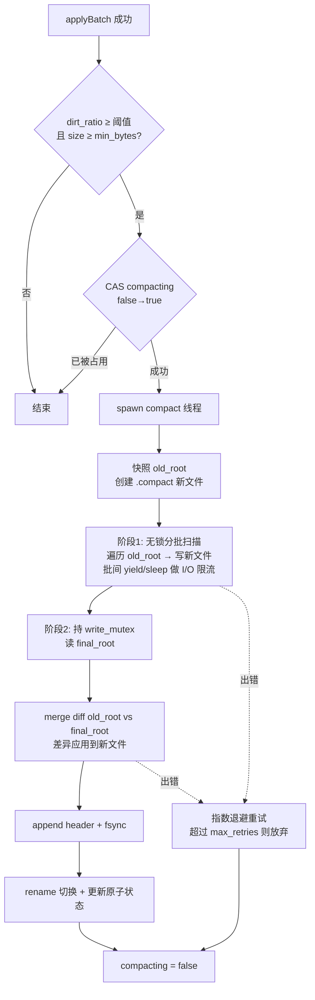
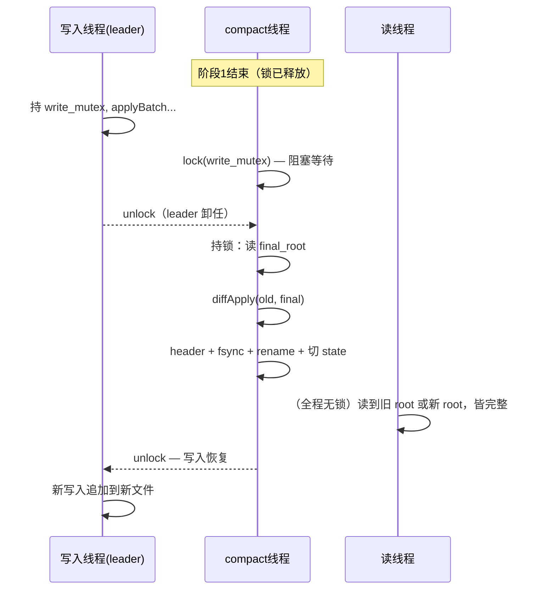

# Auto Compact 设计文档

> 状态：已评审（Grill Me 盘问产出，v2 详细版）
> 目标读者：实现者。假设读过 tutorial 02/03/04/05/06 章（文件格式、Store、B-tree、Writer、DB API）。

---

## 1. 目标与背景

### 1.1 问题

`cube_db` 是 append-only + COW B-tree：每次写把整条路径的节点重写到文件尾，旧节点成为垃圾（dirt）。`dirt` 只增不减，唯一回收手段是 compact——全量重建一个只含活数据的新文件并 rename 切换。

当前 compact 只能手动调 `db.compact()`。长期运行不手动干预，文件无限膨胀，存储空间失控。

### 1.2 现状代码（精确事实）

**触发检查已存在，但只计数不执行**（`src/writer.zig` `applyBatch` 尾部）：

```zig
if (state.opts.auto_compact_dirt_ratio) |ratio| {
    const live = new_byte;
    const total = new_dirt + live;
    if (total >= state.opts.auto_compact_min_bytes and live > 0) {
        const dirt_ratio = @as(f64, @floatFromInt(new_dirt)) / @as(f64, @floatFromInt(total));
        if (dirt_ratio >= @as(f64, @floatCast(ratio))) {
            // ponytail: MVP 自动 compact 标记计数，实际 compaction 由 compactor.zig 实现（M5）
            _ = state.compact_count.fetchAdd(1, .monotonic);  // ← 只 +1，不执行
        }
    }
}
```

**手动 compact 已实现**（`src/db.zig` `doCompact`）：全程持有 `write_mutex` → 遍历全部活 entry 写入 `.compact` 新文件 → append header → fsync → 关旧 FD → rename → 重开新文件 → 更新原子状态。**写入全程阻塞**，阻塞时长 = 全量遍历 + 写入 + fsync，随数据量线性增长。

**本设计要解决的矛盾**：自动 compact 必须在后台跑（不能阻塞在线写入几分钟），但现有 `doCompact` 依赖"全程持锁"来保证遍历期间无新写入。放锁就有"compact 期间新写入丢失"的问题。

### 1.3 目标

| # | 目标 | 验收 |
|---|------|------|
| G1 | 达到阈值自动触发 compact | dirt_ratio ≥ 阈值时无需人工干预，文件被回收 |
| G2 | 写入不被长时间阻塞 | 阶段 1 零阻塞；阶段 2：零写入时 O(1) 提交；有写入时 O(树全量) **只读** merge（内存带宽速度，典型毫秒级；大库最坏 ~0.1s/GB 量级，见 §3.4） |
| G3 | 数据不丢失 | compact 期间的写入在切换后全部可见；删除不复活 |
| G4 | 崩溃安全 | 任意时刻崩溃，重启后数据一致（回退到旧文件或新文件，无中间态） |
| G5 | 读不阻塞、不损坏 | compact 全程读路径可用（沿用现有 MVCC 快照语义） |

非目标（YAGNI）：增量/分层 compact（LSM 式 partial compaction）、多文件 segment、compact 限速 IO、并发多个 compact。

---

## 2. 方案总览



**核心思想**：compact 分两个阶段。

- **阶段 1（无锁分批扫描）**：基于开始时快照 `old_root` 遍历全部活 entry 写入新文件。全程**不持 `write_mutex`**——快照不可变（append-only 只追加新字节）、新文件线程独占，与在线写入无资源冲突。批间 `yield`/`sleep` 做 I/O 限流，避免 compact 全速抢占磁盘带宽影响在线 fsync。
- **阶段 2（终态 diff + 切换，原子）**：重新持有 `write_mutex`（写入暂停），读取此刻的 `final_root`，对两棵树做 merge diff，把"阶段 1 期间的写入差异"补进新文件，然后 header + fsync + rename + 更新状态。持锁期间无写入，`final_root` 稳定，diff 结果就是完整正确的数据。

阶段 2 持锁时长：零写入时 O(1)（`final_root == old_root` 直接提交）；有写入时一次 O(树全量) **只读** merge（未变更 entry 只比较不写入，内存带宽速度），典型毫秒级。

---

## 3. 核心机制详述

### 3.1 触发

**时机**：`applyBatch` 成功路径尾部，所有 `future.set({})` 之后。理由：

- 此刻 `state.dirt/byte_size` 已原子更新，读到的是最新值。
- 在 futures set 之后检查，触发逻辑不增加写请求延迟。
- 每次写后检查（而非定时器），dirt 增长的唯一来源就是写，写后检查必然及时，且空闲期零开销。

**触发代码**（替换现有"只计数"块）：

```zig
// applyBatch 尾部，futures set 之后
if (state.opts.auto_compact_dirt_ratio) |ratio| {
    const live = new_byte;
    const total = new_dirt + live;
    if (total >= state.opts.auto_compact_min_bytes and live > 0) {
        const dirt_ratio = @as(f64, @floatFromInt(new_dirt)) / @as(f64, @floatFromInt(total));
        if (dirt_ratio >= @as(f64, @floatCast(ratio))) {
            _ = state.compact_count.fetchAdd(1, .monotonic); // 保留：观测触发次数
            tryStartCompact(db); // CAS 占用标志 + spawn 线程；已占用则跳过
        }
    }
}
```

**为什么 CAS 而不是判断后再设**：多线程同时通过阈值检查是常态（group commit 下多线程并发 put）。`cmpxchgStrong(false→true)` 只有一个胜者，败者直接返回——无锁队列、无等待。

**spawn 失败必须复位标志**：CAS 成功后 `std.Thread.spawn` 若失败，立即 `compacting.store(false, .release)`——否则标志卡死在 true：手动 compact 的等待循环（§5.5）永久自旋，后续 auto 也永远无法再触发。

**触发上下文不变式（已不作为互斥依据）**：触发检查在 applyBatch 尾部执行，applyBatch 全部调用点必持 `write_mutex` → 手动 compact 持锁期间不会有新 auto 启动。评审 #2 后手动 compact 改为 CAS 对称占用 compacting（§5.5），互斥不再依赖此隐式不变式——将来触发移出锁（定时器、管理 API）也安全。

`auto_compact_dirt_ratio: ?f32`，`null` = 完全禁用自动 compact（保留现有语义，测试和特殊部署用）。

### 3.2 后台执行载体：OS 线程

**决策**：`std.Thread.spawn` 起独立 OS 线程跑 compact。

依据：

- `applyBatch` 在调用方线程（group commit leader 或 `putBatch` 调用者）内同步执行，在它里面直接跑 compact = 阻塞该线程 = 阻塞所有排队写入。必须独立执行体。
- `zio.Mutex` 明确支持外部 OS 线程：foreign thread 在 state word 上走 futex 等待（见 `zio/src/sync/Mutex.zig` 头注释），与协程 waiter 共存。compact 线程用 `write_mutex.lock()` 安全。
- 现有测试已用 `std.Thread.spawn` + `db.put`（`tests/db_test.zig:118`），模式一致。
- 不引入 zio.Runtime：当前 DB 是纯同步 API（`db.zig` 头注释"D3 嵌入式库，纯同步 API"），没有常驻 runtime 可 spawn 协程。

**线程句柄管理**：`Db` 新增 `compact_thread: ?std.Thread`。`close()` 时若存在则 `join`（见 §3.8）。同时只会有一个 compact 线程（CAS 保证），旧线程在 `compacting=false` 前已结束或被 join，不会泄漏叠加。

### 3.3 阶段 1：无锁分批扫描

**快照**：`old_root = state.root.load(.acquire)`（DB 层编码，转 btree 偏移）。append-only 下这棵树永远不可变——批间写入只 append 新节点，不改旧字节；mmap 1TB 预留区不 remap，迭代器持有的 `Store` vtable 读旧 offset 始终有效。

**为什么不持 write_mutex**（设计评审修正）：
阶段 1 只做两件事：读旧树（`old_root` 快照，不可变）、写 `.compact` 新文件（compact 线程独占）。两者与在线写入**无任何共享可变状态**。持锁是把不需要的互斥强加进来，再用"时间片 + 批间释放"缓解它自造的阻塞——且造成恶性循环：锁片稀释扫描速率 → 阶段 1 变长 → 期间累积写入更多 → 阶段 2 diff 更大 → 阶段 2 持锁更久。无锁后阶段 1 全速推进，两端同时改善：**写入零阻塞 + diff 更小**。另：zio.Mutex 是 barging 锁（不交接，waiters 竞争），`yield` 不保证等待的 leader 抢到锁，高写入下锁竞争行为不可预测。

**唯一的共享变量**：迭代器读路径读 `FileStore.logical_len`（边界检查），写入线程 `appendRaw` 写它——非原子 u64 并发读写。这是**无害 race**：`logical_len` 单调递增，迭代器 offset 全部来自 `old_root` 快照（必小于 compact 开始时的 len），读到更大的 len 只是边界放宽，绝无误判。与现有 `get` 零拷贝读路径的 race 性质完全相同（get 本就无锁并发读），不新增风险类别。严格 Zig 语义下仍是 data race，根治一行：`logical_len` 改 `std.atomic.Value(u64)`，建议顺手做。

**批次循环**：

```zig
fn scanPhase(db: *Db, new_store: Store, old_root_db: u64, stats: *Stats) !enum { done, closed } {
    const bt_root = toBtreeRoot(old_root_db);
    if (bt_root == btree.NULL_ROOT) return .done;   // 空树：阶段2只处理 diff（=全部数据）

    var it = try btree.select(db.allocator, db.store, bt_root, null, null);
    defer it.deinit();

    while (true) {
        const deadline = std.time.milliTimestamp() + db.state.opts.compact_time_slice_ms;
        var exhausted = false;
        while (std.time.milliTimestamp() < deadline) {
            const maybe = try it.next();       // 活 entry（tombstone 已被迭代器跳过）
            const e = maybe orelse { exhausted = true; break; };
            stats.new_bt_root = (try btree.insert(db.allocator, new_store, stats.new_bt_root, e.key, e.value, false)).new_root;
            stats.entry_count += 1;
            stats.live_bytes += @intCast(e.key.len + e.value.len + 9); // i64 累计（评审 #4，§3.4）；9 = tombstone(1)+klen(4)+vlen(4)
        }
        if (exhausted) return .done;
        if (db.state.closed.load(.acquire)) return .closed;   // close 介入点（§3.8）
        // I/O 限流：默认只 yield（SSD）；HDD 场景调大 compact_scan_sleep_ms
        if (db.state.opts.compact_scan_sleep_ms > 0) {
            std.Thread.sleep(db.state.opts.compact_scan_sleep_ms * std.time.ns_per_ms);
        } else {
            std.Thread.yield() catch {};
        }
    }
}
```

**`entry` 生命周期**：`it.next()` 返回的 `LeafEntry` 借用迭代器内部 Leaf，下一次 `next()` 或换叶时失效。循环内立即 `btree.insert`（insert 内部 dupe key/value），无悬垂引用。与现有 `doCompact` 模式一致。

**迭代器跨批存活**：`it` 跨批持有。其内部状态（叶子栈、当前 Leaf）引用旧文件的 mmap 字节——旧文件在阶段 2 rename 前不会被关，安全。

### 3.4 阶段 2：树 diff 重放（替代原"文件偏移量重放"）

> **重要修正**：初版方案"记录旧文件末尾偏移量，重放偏移量之后的新记录"**不可行**。偏移量之后追加的是 B-tree **节点记录**（COW 路径上的新节点 + header），不是逻辑 KV 操作；把节点字节当 entry 重放毫无意义，且无法知道哪些 key 被删除。正确做法是对两棵逻辑树做 diff。

**算法：双迭代器 merge diff**。两棵树各自的有序迭代器（活 entry 流，tombstone 已被跳过）：

```
old_it = select(store_old, old_root)      // 阶段1已扫完，重开一个
new_it = select(store_old, final_root)    // 持锁期间 final_root 稳定

// O(1) 捷径：阶段1期间零写入 → 两树相同 → 直接提交，不做 merge
if (final_root == old_root) return;

loop:
  if (db.state.closed.load(.acquire)) return error.Closed;  // close 介入点（评审 #3）：每 entry 可中断
  (o, n) = (old_it.peek, new_it.peek)
  o == null and n == null          → 结束
  n == null or (o != null and o.key < n.key):
      // old 有、final 无 → 阶段1已写入新文件，但 final 中已被删除
      → 新文件 insert(key=o.key, tombstone=true)
      stats.entry_count -= 1
      stats.live_bytes -= @as(i64, @intCast(o.key.len + o.value.len + 9))
      old_it.next()
  o == null or n.key < o.key:
      // final 新增 → 新文件 insert(key=n.key, value=n.value)
      stats.entry_count += 1
      stats.live_bytes += @as(i64, @intCast(n.key.len + n.value.len + 9))
      new_it.next()
  keys equal:
      if !std.mem.eql(u8, o.value, n.value):
          → 新文件 insert(n.key, n.value)  // 覆盖
          // 值变短时为负增量：usize 直接 n.len - o.len 会下溢 → i64 中转（评审 #4）
          stats.live_bytes += @as(i64, @intCast(n.value.len)) - @as(i64, @intCast(o.value.len))
      // 相同则跳过
      old_it.next(); new_it.next()
```

`peek` 实现：迭代器没有 peek，用"各缓存一个当前 entry"的 struct 包一层（`cur: ?LeafEntry`，比较后才 `next`）。注意 `LeafEntry` 借用迭代器内部 Leaf——比较和 insert 都发生在任一迭代器 `next()` 之前，无悬垂。

**统计：i64 累计，提交时断言转回**（评审 #4）：`live_bytes`/`entry_count` 语义是 u64，但 diff 有减法——删除 `-(k+v+9)`、修改增量 `n.len - o.len` 可负——usize 直接减会下溢（Zig 安全模式 panic；ReleaseFast 回绕成天文数字写进 header）。`Stats` 内部用 `i64` 累计，commit 时 `std.debug.assert(>= 0)` 后 `@intCast`。数学上恒非负（删除/修改都与阶段 1 已计 entry 配对），断言把不变式显式化，挡 diff 逻辑 bug。与现有代码同款：`writer.applyBatch` 的 `new_count_signed: i64 = ...; @max(0, ...)`。

**阶段 2 真实成本（自我修正，同时修正评审 #3 的前提）**：merge-join 要**走完两棵树的全部 entry**（相等也须逐一比较确认）——成本是 O(树全量) 只读遍历，**不是** O(diff 大小)。比阶段 1 快一个量级（无 insert、无分配、顺序 mmap 读 + key 比较，内存带宽速度），但大库（如 1GB live）持锁仍可达百毫秒~秒级。缓解：
1. **O(1) 捷径**：`final_root == old_root`（阶段 1 零写入）直接提交。覆盖最常见场景——compact 多在写入低谷触发。
2. **merge 每 entry 可查 closed**（评审 #3），diff 可中断。
3. ponytail 升级路径（需要时再做）：offset-skip 结构 diff（COW 性质：child offset 相同 = 子树物理相同 = 内容相同，整棵跳过，成本缩到 O(变更路径)）；或 merge 分时间片放锁 + 追平循环。MVP 只做 1+2。

**原子性论证**：阶段 2 全程持 `write_mutex` → 无新写入 → `final_root` 不变 → diff 输入稳定。新文件内容 = old_root 全量 ∪ diff = final_root 全量（数学上：old ∪ (final − old) − (old − final 的删除) = final）。rename 后 `state.root = final_root 等价内容的新偏移`，数据完整。

**rename 前最后的防线**：diff 完成到 rename 之间仍在持锁，无窗口。rename 后释放锁，group commit 恢复——新写入追加到新文件，正常。

**退化情况**：merge 是 O(树全量) 只读，与期间写入量无关；真正的恶化场景是"大库 + 触发时仍有写入"（走不了 O(1) 捷径）→ 阶段 2 持锁 ~全量只读遍历。**MVP 接受**（嵌入式 KV 典型库 MB 级，遍历亚毫秒~毫秒；升级路径见上）。

### 3.5 提交切换

diff 完成后（仍持锁）：

```zig
// Stats i64 → u64（评审 #4）：数学上恒非负，断言挡逻辑 bug
std.debug.assert(stats.entry_count >= 0 and stats.live_bytes >= 0);
_ = try file_store.appendHeaderRecord(&new_fs, .{
    .btree_root = if (stats.new_bt_root == btree.NULL_ROOT) 0 else stats.new_bt_root + 1,
    .entry_count = @intCast(stats.entry_count),
    .byte_size = @intCast(stats.live_bytes),
    .dirt = 0,
});
try new_store.sync();

db.fs.close();                                   // munmap + close 旧文件
try zio.Dir.cwd().rename(compact_path, zio.Dir.cwd(), db.path);
db.fs = try file_store.FileStore.create(db.allocator, db.path);
db.store = db.fs.store();
db.state.store = db.store;
db.state.fs = &db.fs;
db.state.root.store(if (stats.new_bt_root == btree.NULL_ROOT) 0 else stats.new_bt_root + 1, .release);
db.state.dirt.store(0, .release);
db.state.entry_count.store(stats.entry_count, .release);
db.state.byte_size.store(stats.live_bytes, .release);
```

> 注（统计虚构，已存在非新引入）：header 的 `dirt = 0` 沿用手动 doCompact 约定。实际上逐条 insert 构建新树时，每次 COW 路径重写都在新文件留下中间垃圾节点；阶段 2 diff 的 tombstone/覆盖也产生少量死字节。都不计入 dirt——只影响触发阈值精度，不影响正确性。升级路径：用 BTreeBatch 构建新树（缓存树一次 flush，垃圾大幅减少，且 WriteResult 给出精确 delta）。

与现有 `doCompact` 的切换序列**逐行一致**（已验证的崩溃安全语义：rename 是唯一提交点；rename 前崩溃旧文件完好；rename 后崩溃新文件已 fsync）。**实现时应把这段抽成共享函数** `commitCompact(db, new_fs, stats)`，手动 compact 和 auto compact 复用，避免两份切换逻辑漂移。

### 3.6 并发控制矩阵

| 并发对 | 机制 | 行为 |
|--------|------|------|
| auto × auto（重复触发） | `compacting` CAS | 败者跳过，零等待 |
| auto × 在线写入（put/delete/putBatch） | 阶段 1 **无锁**；阶段 2 `write_mutex` | 阶段 1 零干扰（读快照 + 写独占新文件）；写入只在阶段 2 被阻塞（零写入 O(1)，有写入 O(树全量) 只读 merge，§3.4） |
| auto × 手动 `db.compact()` | `compacting` CAS（对称占用） | 手动先 CAS 占标志（失败则 sleep 等待），再持 `write_mutex` 执行。谁先占标志谁独占 `.compact` 与切换序列，不依赖触发上下文（§5.5） |
| auto × 读（get/select） | 无锁 MVCC | 读只跟 `state.root` 走；rename 是原子的，读要么旧 root 要么新 root，两棵树各自完整 |
| auto × close | `closed` 标志 + join | 见 §3.8 |

### 3.7 失败处理：指数退避重试

**失败点**：阶段 1 迭代 IO 错误、阶段 2 diff IO 错误、appendHeaderRecord/sync/rename 失败、OOM。

**策略**：

```zig
fn runCompact(db: *Db) void {
    var attempt: u32 = 0;
    while (true) {
        cleanupCompactFile(db);            // 删除可能残留的 .compact
        compactOnce(db) catch |err| {
            attempt += 1;
            if (attempt >= db.state.opts.compact_max_retries or
                db.state.closed.load(.acquire)) {
                log.warn("auto compact gave up after {d} attempts: {s}", .{ attempt, @errorName(err) });
                _ = db.state.compact_fail_count.fetchAdd(1, .monotonic);
                db.state.compacting.store(false, .release);
                return;
            }
            const backoff_ms = @min(db.state.opts.compact_retry_base_ms << @intCast(attempt - 1), 60_000);
            std.Thread.sleep(backoff_ms * std.time.ns_per_ms);  // 不持任何锁睡眠
            continue;
        };
        _ = db.state.compact_success_count.fetchAdd(1, .monotonic);
        db.state.compacting.store(false, .release);
        return;
    }
}
```

- 默认 `compact_retry_base_ms = 1000`，序列 1s→2s→4s→8s→16s，cap 60s；`compact_max_retries = 5`。
- 重试间隔**不持锁**：写入正常进行。dirt 继续增长也没关系——下次尝试重新全量扫。
- 最终放弃：清标志 + 计数。下次 `applyBatch` 触发检查还会再来（阈值仍满足，因为 dirt 没回收）——所以"放弃"不是死路，是自然冷却。
- **每次尝试从头开始**（重扫 old_root），不恢复中间进度。幂等：任意次尝试结果相同。崩溃恢复同理（§4）。

### 3.8 与 close 的交互

**问题**：`close()` 当前不持任何锁：直接 `closed=true → sync → fs.close → destroy`。auto compact 线程若在跑，会在已关闭的 fd/mmap 上继续操作 → UB。

**方案**：

1. `Db` 新增 `compact_thread: ?std.Thread = null`。
2. compact 线程的每个可中断点检查 `state.closed`：阶段 1 批间、**阶段 2 merge 循环每 entry**（评审 #3）、重试睡眠（拆 100ms 小睡，每醒一查）。发现则中止本次 compact（清理 `.compact` 文件、清标志、线程退出）。
3. `close()`：
   ```zig
   self.state.closed.store(true, .release);
   if (self.compact_thread) |t| t.join();   // 等 auto compact 线程退出（最坏一个时间片）
   // 等可能正在进行的手动 compact（不占线程，占 compacting 标志）——
   // 手动 compact vs close 是现有代码就有的 race（close 不持 write_mutex），借标志一并修
   while (self.state.compacting.load(.acquire)) std.Thread.sleep(1 * std.time.ns_per_ms);
   self.store.sync() catch {};
   self.fs.close();
   // ... 原有释放
   ```
4. join 之后不可能再有 compact 线程操作 fs。`closed` 也阻止新的触发（`tryStartCompact` 先查 `closed`）。

**close 最坏延迟**（评审 #3 修正——原文"一个时间片"错了，漏算阶段 2）：
- 阶段 1 中：≤ 一个时间片（批间查 closed）。
- 阶段 2 merge 中：≤ 一个 entry 处理时长（merge 循环每 entry 查 closed，可中断；中断删 `.compact` 退出，新文件本未提交，无一致性问题）。
- 阶段 2 commit 序列（header + fsync + rename + 重开 + 状态切换）：**不可中断**——rename 是提交点，半途没有安全状态可停，必须走完。但这是**固定成本**（与树大小、diff 无关），主导项一次 fsync，典型毫秒级。
- 退避睡眠中：≤ 100ms（拆小睡）。
- **合计最坏 ≈ 时间片 + 一个 entry + commit 固定成本**。评审担心的"等整个阶段 2（O(树全量) merge）"由 merge 循环的 closed 检查消除。

### 3.9 读的并发风险（已存在，非新引入）

`get` 零拷贝路径持有 mmap 借用切片时，若 compact 恰好 rename 并 `munmap` 旧文件 → 借用切片悬垂。**这是现有代码就存在的风险**（手动 `doCompact` 同样 munmap），auto compact 只是提高了触发频率。

MVP 处理：`// ponytail: reader 借用窗口极短（ns~µs），rename 撞上的概率近零；若成为问题，引入 epoch/reader-count 屏障，rename 前等待活跃 reader 归零`。文档记录在案，不在本设计实现。接受此风险是因为 get 的借用切片生命周期 = 单次 btree.get 调用内，拿到 value 立即 dupe 返回，窗口是纳秒级。

---

## 4. 错误处理与崩溃恢复

### 4.1 崩溃场景全表

| # | 崩溃点 | 磁盘状态 | 重启行为 | 数据一致性 |
|---|--------|----------|----------|------------|
| C1 | 阶段 1 扫描中 | 旧文件完好（含最新 header）；`.compact` 半成品 | open 时检测并删除 `.compact`（§4.2） | ✅ 旧文件即最新态 |
| C2 | 阶段 2 diff 中 | 同上 | 同上 | ✅ |
| C3 | 新文件 header 写完、fsync 前 | 同上（`.compact` 可能完整但未提交） | 同上 | ✅ rename 未发生 = 未提交 |
| C4 | fsync 后、rename 前 | 旧文件完好；`.compact` 完整 | 删除 `.compact` | ✅（浪费一次 compact，正确性无损） |
| C5 | rename 后 | 新文件完整（已 fsync）；旧文件已消失 | 正常 open 新文件 | ✅ 新文件 = final_root 全量 |
| C6 | rename 中（rename 本身） | POSIX rename 原子 | 旧或新，二者之一完整 | ✅ |

关键不变式：**rename 是唯一提交点**。rename 前旧文件永远是完整最新态；rename 后新文件已 fsync。与现有手动 compact 完全一致的崩溃语义。

### 4.2 启动恢复

`Db.open` 增加一步（在现有 header 扫描之前）：

```zig
// 上次 auto compact 半途而废的残留
const compact_path = try std.fmt.allocPrint(allocator, "{s}.compact", .{path});
defer allocator.free(compact_path);
zio.Dir.cwd().deleteFile(compact_path) catch {};  // 不存在则忽略
```

`.compact` 永远可以直接删：它只有在 rename 后才成为"真数据"，而 rename 后它就不叫 `.compact` 了。所以"存在 `.compact` ⟺ 上次 compact 未提交"恒成立。

注意现有手动 `doCompact` 开始时也有 `cwd.deleteFile(compact_path) catch {}`，所以该恢复逻辑对两条路径统一成立。

### 4.3 重试期间的崩溃

重试循环在 OS 线程内，进程崩溃 = 线程消失 = 退避状态丢失。无妨：重启后阈值检查会在下次 `applyBatch` 自然重新触发 compact（dirt 仍在）。无持久化状态需要恢复。

---

## 5. 接口设计

### 5.1 配置项（`writer.Options` 扩展）

```zig
pub const Options = struct {
    // —— 现有 ——
    auto_compact_dirt_ratio: ?f32 = 0.30,            // dirt/(dirt+live) 触发阈值；null 禁用
    auto_compact_min_bytes: u64 = 16 * 1024 * 1024,  // 文件总字节下限，小于此不触发
    fsync: bool = true,

    // —— 新增 ——
    /// 阶段1单批时间片（毫秒）。越小限流越频繁、compact 总耗时越长（批间开销）。
    compact_time_slice_ms: u64 = 10,
    /// 阶段1批间 I/O 限流睡眠（毫秒）。0 = 只 yield（SSD 默认）；HDD 场景调大（如 5~20）。
    /// 注意权衡：限流越狠，阶段1越长 → 阶段2 diff 越大 → 阶段2持锁越久。
    compact_scan_sleep_ms: u64 = 0,
    /// 失败最大重试次数（单次触发内）。达到后放弃并等下次触发。
    compact_max_retries: u32 = 5,
    /// 重试退避基数（毫秒），第 n 次退避 = base << (n-1)，cap 60s。
    compact_retry_base_ms: u64 = 1000,
};
```

默认值依据：10ms 时间片 ≈ 一次 group commit 合并窗口的量级，写入 P99 增加可控；1s 退避基数对 IO 瞬断足够宽容；5 次重试覆盖约 31s 的连续故障。

### 5.2 状态（`writer.State` 扩展）

```zig
pub const State = struct {
    // —— 现有字段保留 ——
    ...
    compact_count: std.atomic.Value(u32),           // 触发次数（现有，保留）

    // —— 新增 ——
    /// auto compact 进行中（CAS 去重 + 手动 compact 互斥）
    compacting: std.atomic.Value(bool) = .init(false),
    /// 成功/失败计数（可观测性）
    compact_success_count: std.atomic.Value(u32) = .init(0),
    compact_fail_count: std.atomic.Value(u32) = .init(0),
};
```

### 5.3 `Db` 变更

```zig
pub const Db = struct {
    // —— 现有字段 ——
    ...
    // —— 新增 ——
    /// auto compact OS 线程句柄（close 时 join）
    compact_thread: ?std.Thread = null,
};
```

`close()` 变更：`closed=true` 后先 `join` compact 线程（§3.8）。
`open()` 变更：删除残留 `.compact`（§4.2）。

### 5.4 新文件 `src/compactor.zig`

```zig
//! compactor.zig — 自动 compaction（M5）：后台线程、分批扫描、树 diff 重放、退避重试
const std = @import("std");

pub const Stats = struct {
    new_bt_root: u64,      // 新文件当前 btree root（btree 层偏移）
    // i64 累计（评审 #4）：阶段 2 diff 有减法（删 -(k+v+9)、改 ±Δv），
    // commit 时断言非负再 @intCast 转 u64。同 writer.applyBatch 的 *_signed 模式。
    entry_count: i64,
    live_bytes: i64,
};

/// 触发入口：CAS 占用 compacting，spawn 线程。已占用/已关闭则静默跳过。
pub fn tryStartCompact(db: anytype) void;

/// compact 线程主函数：cleanup → compactOnce（含重试循环）→ 清标志。
fn runCompact(db: anytype) void;

/// 单次尝试：阶段1分批扫描 + 阶段2持锁 diff + commitCompact。
fn compactOnce(db: anytype) !void;

/// merge diff 两棵树，差异应用到 new_store。持 write_mutex 调用。
fn diffApply(db: anytype, new_store: Store, old_root_db: u64, final_root_db: u64, stats: *Stats) !void;

/// 切换序列（从 doCompact 抽出，手动/自动复用）。
pub fn commitCompact(db: anytype, new_fs: *file_store.FileStore, stats: Stats) !void;
```

（`anytype` = `*Db`，避免循环 import；或把 compactor 函数放 `db.zig`，`ponytail` 倾向前者更清晰，后者文件更少——实现时定，默认独立文件，与 M5 注释中的预言一致。）

### 5.5 手动 `db.compact()` 变更（评审 #2 修正：对称 CAS 占用）

```zig
pub fn compact(self: *Self) !void {
    // 对称互斥：手动也 CAS 占用 compacting。
    // 占用 = 独占 .compact 文件与 fs 切换序列，不依赖"触发只在 write_mutex 内"的隐式不变式。
    // 顺序铁律：先 CAS compacting、后 lock write_mutex——反了死锁（见下）。
    while (self.state.compacting.cmpxchgStrong(false, true, .acq_rel, .acquire) != null) {
        std.Thread.sleep(1 * std.time.ns_per_ms); // auto 可能跑很久，别纯 yield 烧核
    }
    defer self.state.compacting.store(false, .release);

    try self.write_mutex.lock();
    defer self.write_mutex.unlock();
    return self.doCompact(); // 内部走 commitCompact 共享切换
}
```

**评审 #2 的分析与裁定**：

- 评审描述的竞态（manual doCompact 与 auto commit 交错，auto 把过时 `.compact` rename 回去）在**当前设计下不可复现**：tryStartCompact 只在 applyBatch 尾部调用，而 applyBatch 全部调用点（sendRequest leader、putBatch）都持 `write_mutex` → 触发必在锁内；手动 compact 从"看到 compacting==false"到 doCompact 返回连续持锁，新 auto 无法在此窗口诞生；已在跑的 auto 则 compacting==true，等待循环不放行。
- 但安全性押在**隐式不变式**"触发只在 write_mutex 内发起"上——文档未声明且脆弱（盘问阶段讨论过定时器触发；将来触发移出锁或加管理 API，竞态立刻活：双写同一 `.compact` 路径、auto commit 的 close-then-rename 非原子——rename 失败时 db.fs 已关，DB 不可用到重开）。
- 修复成本极低（CAS 循环替代 load 循环），互斥变对称自包含：**谁持 compacting，谁独占 `.compact` 与切换序列**。采纳。

**死锁论证**：顺序必须是 CAS→lock。反过来（持 write_mutex 自旋等 compacting）：manual 持 write_mutex 等 compacting；auto 阶段 2 持 compacting 等 write_mutex——循环等待，死锁。现顺序下：auto commit 从不等 compacting（完成后才 store false），tryStartCompact CAS 失败只跳过不等待 → 无循环等待。

**defer 顺序**：LIFO → 先 unlock write_mutex、后清 compacting。等待中的 auto 只会在标志清零后启动，彼时 write_mutex 已空闲。

---

## 6. 并发安全分析

### 6.1 锁协议

唯一锁：`write_mutex`。规则：

1. 修改旧文件的只有 group commit / putBatch（持锁）——compact **从不写旧文件**。
2. compact 写 `.compact` 新文件：独占（CAS 保证单线程），无需锁。
3. compact **只在阶段 2 持锁**：需要"无写入窗口"读稳定 `final_root`、diff 应用、原子切换。阶段 1 无锁（§3.3）。
4. 锁获取顺序只有一个（`write_mutex` 单锁），无锁序 → **无死锁**。`queue_mutex` 只在 group commit 内部用，compact 不碰。
5. `FileStore.logical_len` 非原子并发读写（compact 迭代器读 vs `appendRaw` 写）：无害 race，单调递增 + 旧 offset 恒有效，与 get 路径同性质（§3.3）。根治：`logical_len` 改 `std.atomic.Value(u64)`。
6. `compacting` 标志持有者（auto 线程或手动 compact）独占 `.compact` 文件的创建/写入/rename 与 fs 切换序列。占用顺序铁律：**先 CAS compacting，后 lock write_mutex**（反序死锁，§5.5）。

### 6.2 阶段 2 持锁时序



### 6.3 活锁/饿死

- 写入不会饿死：阶段 1 无锁（零阻塞）；阶段 2 持锁有限（∝ diff 大小，典型毫秒级）。
- compact 不会饿死：阶段 1 不竞争任何锁，全速推进；唯一等待是阶段 2 抢 `write_mutex`（futex 竞争，group commit 批间有间隙，必然拿到）。

---

## 7. 边界条件全集

| # | 场景 | 行为 |
|---|------|------|
| E1 | 空 DB（root=0）被触发 | 阶段 1 直接 done；阶段 2 diff(old=空, final)：若 final 仍空，写空 header 切换（dirt 清零，无意义但无害）；实际上触发条件 `live > 0` 已排除 |
| E2 | 全部 entry 被删（live=0） | 触发条件 `live > 0` 不触发。手动 compact 已有同样行为（`dirt.store(0)`） |
| E3 | 文件 < min_bytes 但 dirt_ratio 高 | 不触发（小文件回收收益低，避免频繁 compact 小库） |
| E4 | `auto_compact_dirt_ratio = null` | 完全禁用，含触发检查 |
| E5 | 阶段 1 期间 key 被反复改写 | old_root 里是旧值，diff 拿 final 新值覆盖——最终正确 |
| E6 | 阶段 1 期间 key 被删除 | final 迭代器跳过 tombstone → diff 走"old 有 final 无"分支 → 新文件补 tombstone → 删除不复活 |
| E7 | 阶段 1 期间新增 key | diff 走"final 新增"分支插入 |
| E8 | 阶段 1 期间零写入 | `final_root == old_root` → **O(1) 捷径**：不做 merge，直接提交（覆盖最常见场景） |
| E9 | compact 完成瞬间 dirt 又超阈值 | 下次 applyBatch 再触发。若写入速率 > compact 扫描速率，会连续 compact——有效（每次都在追赶），但 CPU 高。接受；`ponytail:` 可加"距上次完成不足 X 秒不触发"冷却，需要时再加 |
| E10 | 超大单 value（如 100MB） | 一个 entry 处理超时间片——批内 `deadline` 只在 entry 边界检查，单 entry 不中断。阶段 1 无锁后这不影响写入，只是限流粒度变粗，可接受 |
| E11 | compact 线程中 OOM | 走失败重试；重试仍 OOM 则放弃，不影响在线写入（写路径内存独立） |
| E12 | mmap 不可用（mmap_base=null，回退 pread） | 迭代器走 `read`（alloc 路径），功能正常只是非零拷贝；compact 逻辑无 mmap 依赖 |

---

## 8. 测试计划

### 8.1 单元测试（`src/compactor.zig` 内 test 块 + `tests/`）

| 测试 | 构造 | 断言 |
|------|------|------|
| T1 触发-阈值边界 | dirt_ratio = 0.29 / 0.30 / 0.31 | 0.29 不触发，0.30/0.31 触发（compact_count 增量） |
| T2 触发-min_bytes | total < min_bytes 且 ratio 高 | 不触发 |
| T3 禁用 | ratio=null | applyBatch 后 compact_count 不变 |
| T4 CAS 去重 | 10 线程同时 put 越过阈值 | compact 只执行 1 次（success_count == 1 或 compacting 同时刻唯一） |
| T5 退避序列 | 注入连续失败 | 重试间隔 1s,2s,4s,8s,16s（mock 时钟或缩 base 到 1ms 断言序列） |
| T6 最大重试 | max_retries=3，连续失败 | 放弃，compacting=false，fail_count=1，写路径仍正常 |
| T7 merge diff | 手工构造 old/final 两树（增/删/改/不变各若干 key） | diff 后新文件内容 == final 全量（逐 key get 比对 + entry_count 精确） |

### 8.2 集成测试（`tests/auto_compact_test.zig`）

| 测试 | 构造 | 断言 |
|------|------|------|
| I1 端到端回收 | min_bytes 调小（如 64KB），写入制造 dirt 超阈值，等 compact | 文件 size 显著缩小；全部 key 可读；dirt==0 |
| I2 并发写不丢 | compact 进行中（用 fault/延迟注入拉长阶段 1）持续 put/delete/改写 | 完成后：所有 key 终值正确；删除未复活；count 精确 |
| I3 写阻塞有界 | 高频写 + 统计 put 延迟 | put P99 增量 < （时间片 + 阈值），无秒级尖峰 |
| I4 手动×自动 | auto 进行中调 db.compact() | 不报错，等待后完成，数据正确 |
| I5 close 安全 | compact 进行中 close() | close 返回（有界等待），无崩溃、无泄漏（testing.allocator 检测） |
| I6 连续触发 | 持续写入使多次达标 | success_count 递增，每次数据正确 |
| I7 空库/单 entry/全删库 | 各边界形态构造 dirt | 不崩溃，不触发或正确回收 |

### 8.3 故障注入（`src/fault_store.zig` 扩展 + 测试）

| 测试 | 注入 | 断言 |
|------|------|------|
| F1 扫描中崩 | 阶段 1 中途进程级模拟（kill 线程 ≈ 删 .compact 重开） | 重启 open 正常，数据=旧文件最新态 |
| F2 diff 中失败 | fault_store 在 diff 阶段 IO 错 | 重试后成功，数据正确 |
| F3 rename 前失败 | header 写完后注入 | 重启后旧文件完好，.compact 被清理 |
| F4 rename 后 | 正常路径 | 等价于成功用例，新文件完整 |
| F5 连续失败后成功 | 前 2 次注入失败 | 第 3 次成功，数据正确 |

**测试基建需求**：

- `fault_store` 增加"按阶段注入"能力：包一层 Store，计数 append 调用，第 N 次后失败。
- 时间片/退避在测试中调小（`compact_time_slice_ms=1`、`compact_retry_base_ms=1`），避免测试慢。
- "等 compact 完成"：轮询 `compacting == false`（测试可访问 `db.state`）。

---

## 9. 实现任务拆分

| # | 文件 | 改动 | 依赖 |
|---|------|------|------|
| 1 | `src/writer.zig` | Options +3 字段；State +3 字段；applyBatch 尾部触发块改为调 `compactor.tryStartCompact` | — |
| 2 | `src/db.zig` | Db +`compact_thread`；open 删 `.compact`；close join；doCompact 抽 `commitCompact` 共享；手动 compact 加等待循环 | 1 |
| 3 | `src/compactor.zig`（新） | tryStartCompact / runCompact / compactOnce / scanPhase / diffApply / commitCompact 引用 | 1, 2 |
| 4 | `src/root.zig` | 导出 compactor | 3 |
| 5 | `src/fault_store.zig` | 按阶段/按次数注入能力 | — |
| 6 | `tests/auto_compact_test.zig`（新） | I1–I7 | 3, 5 |
| 7 | 单元测试 T1–T7 | 散于 compactor.zig test 块 | 3, 5 |
| 8 | `docs/tutorial/05-writer.md` | §5 自动 compact 段更新为真实行为 | 全部完成后 |
| 9 | `docs/usage.md` | 配置项说明 | 1 |

建议实现顺序：1→2→3（骨架，先同步无重试跑通 I1）→ 3 补 diff/重试 → 5→6/7 → 8/9。

---

## 10. 性能与资源分析

| 维度 | 量 | 说明 |
|------|-----|------|
| 磁盘写放大 | 1× live + diff | 全量重写活数据（与手动 compact 相同）+ 阶段 1 期间的增量 |
| 额外内存 | O(树高 × branch) + O(leaf) | 两个迭代器栈 + 各一个当前 Leaf；无全量缓冲 |
| CPU | 扫描 1× + diff ≈ 写入增量 | 时间片外零开销（无线程常驻，不触发不 spawn） |
| 写延迟影响 | 阶段 1 = 0；阶段 2 = O(1)（零写入捷径）或 O(树全量) 只读 merge | merge 无 insert 无分配，内存带宽速度（~0.1s/GB 量级）；嵌入式 MB 级库为亚毫秒~毫秒；升级路径 offset-skip 结构 diff（§3.4） |
| 读延迟影响 | ~0 | 读无锁；唯一接触点是 rename 瞬间的 root 原子切换 |

---

## 11. 风险与权衡

| 风险 | 概率 | 影响 | 缓解 | 残余 |
|------|------|------|------|------|
| 阶段 2 merge 是 O(树全量) 只读，大库持锁百毫秒~秒级 | 中（大库 + 触发时有写入） | 写延迟尖峰 | O(1) 捷径覆盖零写入场景；升级路径 offset-skip 结构 diff / merge 分片放锁（§3.4） | 接受（嵌入式 MB 级库毫秒级） |
| rename 撞零拷贝 reader（mmap 悬垂） | 极低（ns 窗口） | 崩溃/脏读 | 已存在风险，记录在案；升级路径 reader-epoch 屏障 | 接受（MVP） |
| 连续重试失败，空间不回收 | 低（持续 IO 故障） | 磁盘涨 | 5 次放弃后下次触发再来；fail_count 可监控 | 接受 |
| 高写入下连续 compact（E9） | 中 | CPU 高 | 每次 compact 都在收敛 dirt；需要时加冷却 | 接受 |
| 测试慢（退避/时间片真实时间） | — | CI 慢 | 测试用小参数 + 可注入时钟（如需要） | 已缓解 |

### 被否决的方案（含理由）

| 方案 | 否决理由 |
|------|----------|
| 文件偏移量重放（初版） | **不可行**：偏移量后是 B-tree 节点记录非逻辑 KV，且无法表达删除 |
| 双写（批间写同时写旧+新文件） | 写路径放大 2×；新文件尚不完整时写入的 entry 顺序/结构无法保证；复杂度高于 diff |
| 全程持锁（现状手动 compact 直接自动版） | 大库阻塞写入数分钟，违反 G2 |
| 增量/LSM 分层 compaction | 引入 segment/manifest/层级概念，架构级改动；YAGNI，全量重建对嵌入式 KV 规模足够 |
| MVCC 版本链（每 entry 带版本，diff 免比较） | 文件格式改动 + 永久空间开销，杀鸡用牛刀 |
| zio 协程跑 compact | 当前 DB 无常驻 runtime；为 compact 引入 runtime 是本末倒置。std.Thread + futex mutex 已够用 |

---

## 12. 附录：关键代码索引

| 概念 | 位置 |
|------|------|
| 现有触发检查（只计数） | `src/writer.zig` `applyBatch` 尾部 |
| 现有手动 compact | `src/db.zig` `doCompact`（含切换序列） |
| 迭代器（跳过 tombstone） | `src/btree.zig` `Iterator.next` |
| mmap 稳定性（1TB 不 remap） | `src/file_store.zig` `MMAP_REGION` |
| zio.Mutex 支持 OS 线程 | `zio/src/sync/Mutex.zig` 头注释（foreign threads → futex） |
| 现有多线程写测试 | `tests/db_test.zig:118`（std.Thread.spawn 模式） |
