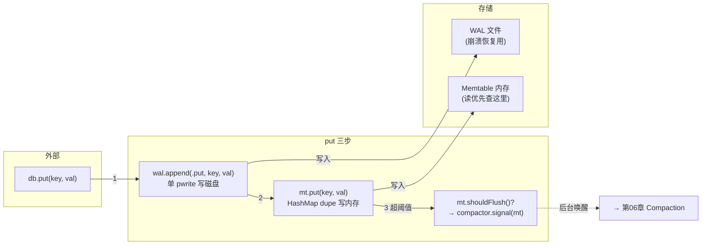

# 03 Put：WAL + memtable + flush 信号

> 数据流的写路径——快的关键：先写日志、再写内存、满了再说

---

本章对应 `src/db.zig` 第 71-90 行的 `Db.put` LSM 分支，涉及 `src/wal.zig` 的 `append` 和 `src/memtable.zig` 的 `put` / `shouldFlush`。

---

## 函数签名

```zig
// src/db.zig:71
pub fn put(self: *Db, key: []const u8, value: []const u8) !void
```

参数：key、value，都是字节切片。

没有返回值（`!void`）。如果 WAL 写失败或 memtable 满了（而不是应该 flush，是真的满了），才报错。

---

## 数据流全景

```
put("hello", "world")
  │
  ├─ 1. wal.append(.put, "hello", "world")    // 磁盘：单 pwrite
  │       │
  │       └─ 格式: [type(1) + key_len(4) + val_len(4) + key(N) + val(M) + crc32(4)]
  │
  ├─ 2. mt.put("hello", "world")              // 内存：HashMap dupe
  │       │
  │       └─ 内部: dupe key+value → index HashMap + entries ArrayList
  │
  └─ 3. if (mt.shouldFlush())                  // 超阈值？
         compactor.signal(mt);                 // 唤醒后台线程
```

---

## 第一步：WAL append（`src/wal.zig:98`）

```zig
pub fn append(self: *Wal, entry_type: EntryType, key: []const u8, value: []const u8) !u64
```

**WAL 格式**（写日志，一行一条记录）：

```
[magic(8B) + version(4B)]  ← 文件头，只在 init 时写
[type(1B) + key_len(4B) + val_len(4B) + key(N) + val(M) + crc32(4B)]  ← 每次 append
```

具体实现：

```zig
// 计算总长度：hdr(9) + key + value + crc(4)
const total: usize = 9 + key.len + value.len + 4;

// 小值走栈缓冲（≤4096B），零分配；大值走堆
var stack_buf: [4096]u8 = undefined;
const heap_buf = if (total > stack_buf.len) try self.allocator.alloc(u8, total) else null;
defer if (heap_buf) |hb| self.allocator.free(hb);
const buf: []u8 = if (heap_buf) |hb| hb else stack_buf[0..total];

// 组装连续缓冲
buf[0] = @intFromEnum(entry_type);       // type: put=0, delete=1
// key_len, val_len 小端写
std.mem.writeInt(u32, buf[1..][0..4], @as(u32, @intCast(key.len)), .little);
std.mem.writeInt(u32, buf[5..][0..4], @as(u32, @intCast(value.len)), .little);
@memcpy(buf[9 .. 9 + key.len], key);     // key
@memcpy(buf[9 + key.len .. 9 + key.len + value.len], value); // value

// CRC32 覆盖 hdr + key + value
var crc = std.hash.Crc32.init();
crc.update(buf[0 .. total - 4]);
std.mem.writeInt(u32, buf[total - 4 ..][0..4], @as(u32, crc.final()), .little);

// 单次 pwrite（优化关键：原是 4 次独立的 pwrite，合并为 1 次，快 ~3.8×）
_ = c.pwrite(self.fd, buf.ptr, total, tot(pos));

self.append_pos = pos + 9 + key.len + value.len + 4;
```

> **性能关键**：原来每次 append 做 4 次 `pwrite`（type、key、value、crc 各一次）。优化后组装到连续缓冲，**单次 pwrite**。WAL append 从 24.8 µs 降到 6.4 µs。

> **Zig 注意**：`std.mem.writeInt` 是小端写，`std.hash.Crc32` 是标准 CRC32。`try` 前面没有变量名？Zig 允许 `try expr` 将错误传播给调用方。

---

## 第二步：Memtable put（`src/memtable.zig:43`）

```zig
pub fn put(self: *Memtable, key: []const u8, value: []const u8) !bool
```

Memtable 内部结构：

| 成员 | 类型 | 作用 |
|------|------|------|
| `index` | `std.StringHashMap(usize)` | key → 在 entries 中的下标 |
| `entries` | `std.ArrayList(MemEntry)` | 按插入顺序存储的所有 KV |
| `size_bytes` | usize | 当前估算大小（用于 flush 阈值） |
| `threshold` | usize | 触发 flush 的阈值 |

插入逻辑：

```
if key 已存在：
    释放旧 value → dupe 新 value → 更新 size_bytes → 返回 false
else:
    dupe key + value → append 到 entries → index 插入 → size_bytes += key.len + value.len → 返回 true
```

```zig
// 更新已有 key
if (self.index.get(key)) |idx| {
    const entry = &self.entries.items[idx];
    if (!entry.tombstone) self.size_bytes -|= entry.value.len;
    self.allocator.free(entry.value);
    entry.value = try self.allocator.dupe(u8, value);
    entry.tombstone = false;
    self.size_bytes += value.len;
    return false;
}
// 新 key
const owned_key = try self.allocator.dupe(u8, key);
const owned_value = try self.allocator.dupe(u8, value);
try self.entries.append(self.allocator, .{ .key = owned_key, .value = owned_value, .tombstone = false });
try self.index.put(owned_key, idx);
self.size_bytes += key.len + value.len;
return true;
```

> **Zig 注意**：`-|=` 是 Zig 的饱和减法——不会下溢（underflow），如果减到负就停在 0。`allocator.dupe` 是 Zig 常见的「分配并拷贝」模式。

---

## 第三步：shouldFlush → compactor.signal

```zig
if (mt.shouldFlush()) {
    if (self.compactor) |c| c.signal(mt);
}
```

```zig
// src/memtable.zig:107
pub fn shouldFlush(self: *Memtable) bool {
    return self.size_bytes >= self.threshold;
}
```

当 memtable 大小超过阈值时，通知后台 compactor 来收货：

```zig
// src/compactor.zig:98
pub fn signal(self: *Compactor, mt: *memtable_mod.Memtable) void {
    self.mutex.lock() catch {};
    defer self.mutex.unlock();
    self.pending_memtable = mt;
    self.cond.signal();  // 唤醒后台线程
}
```

compactor 后台线程收到 signal 后，会在下一轮循环中调 `flush(mt)`，走「snapshot → Request[] → applyBatch → wal.truncate → mt.clear」路径（第 06 章细讲）。

---

## 为什么 LSM 的 put 这么快

LSM put 只做了**两个操作**：一个顺序磁盘写（WAL）+ 一个内存 HashMap 插入。

对比 COW 路径：找到 B-tree 叶页 → 复制页链到根 → 写 meta 页——每条 put 要复制 O(log N) 页（4096 字节每页）。

LSM 把随机 B-tree 写变成了**顺序日志追加 + 批量灌入**。这就是 46× 加速的来源。

---

## Mermaid：put 数据流



---

## 读完本章能回答

- 一次 LSM put 做了哪三件事？（WAL append → memtable put → 检查 flush）
- WAL append 的性能关键是什么？（单 pwrite 代替 4 次 syscall）
- memtable 满了会怎么样？（后台 compactor 被 signal 唤醒，批量灌 B-tree）
- WAL 记录为什么有 CRC32？（恢复时校验完整性，坏记录跳过）

---

下一步：[04 Get——memtable 优先 + B-tree 兜底](04-get.md)
