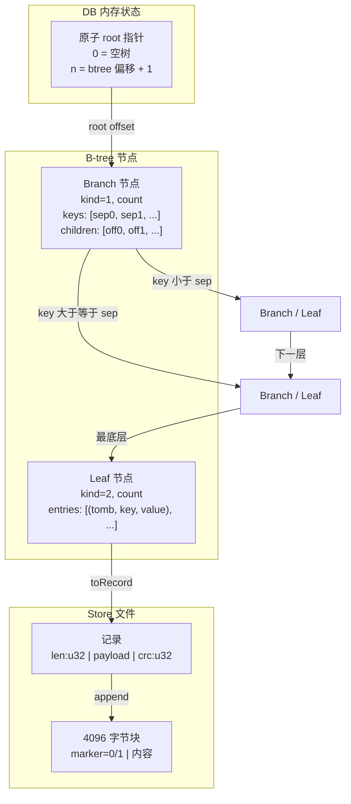

# 04 - 不可变 B-tree

## 本章目标

读完本章，你应该能：
- 理解 B-tree 在 `cube_db` 中的作用。
- 解释什么是“不可变 B-tree”和“Copy-on-Write”。
- 看懂 `src/btree.zig` 里的查找、插入、删除、范围查询。

---

## 1. 为什么用 B-tree？

`cube_db` 是一个 KV 数据库。核心需求是：

- 给定一个 key，快速找到 value。
- 支持按 key 范围扫描。

如果数据全部存在内存里，用 `std.StringHashMap` 就够了。但 `cube_db` 的数据要持久化到磁盘，而且要支持大量数据。

B-tree 的优点：
- 每个节点大小固定（通常和磁盘块大小接近），一次磁盘 IO 可以读一个节点。
- 树高很低，查找只需要几次 IO。
- 天然支持范围查询。

`cube_db` 的 B-tree 是**不可变**的：每次修改都生成新版本，旧版本不破坏。

---

## 2. 什么是不可变 B-tree？

普通 B-tree 是“可变”的：

```
修改 leaf 里的 value → 直接改那个位置
```

不可变 B-tree 不一样：

```
修改 leaf 里的 value → 创建一个新的 leaf，把旧 leaf 的其他内容复制过来
→ 父节点指向新 leaf 的偏移变了，所以父节点也要新建
→ 父节点的父节点也要新建
→ 一直到 root
```

听起来很浪费？其实只改了一条路径，没变的分支全部复用。

这就是 **Copy-on-Write（COW）**：写时才复制，只复制被影响的部分。

---

## 3. 树高与节点大小

`cube_db` 定义了节点容量：

```zig
pub const LEAF_MAX_ENTRIES: usize = 32;       // 叶子最多 32 条 entry
pub const LEAF_MIN_ENTRIES: usize = 16;       // 最少 16 条（当前未做合并）
pub const BRANCH_MAX_CHILDREN: usize = 32;    // branch 最多 32 个子节点
pub const BRANCH_MIN_CHILDREN: usize = 16;
```

树的结构：

```
            Root (Branch)
          /  |  ... |  \
       Branch ... Branch
       /  \            /  \
    Leaf Leaf       Leaf Leaf
```

- 根节点可以是 Branch 或 Leaf（树只有一层时）。
- Leaf 存 entry。
- Branch 存分隔 key 和子节点偏移。

空树用哨兵表示：

```zig
pub const NULL_ROOT: u64 = std.math.maxInt(u64);
```

为什么不用 0？因为第一个 `append` 返回的逻辑偏移就是 0。用 `maxInt(u64)` 不会和真实偏移冲突。

---

## 4. 内存里的 Branch 和 Leaf

`src/btree.zig` 里定义了内存表示：

```zig
pub const Leaf = struct {
    entries: std.ArrayList(LeafEntry),
};

pub const LeafEntry = struct {
    tombstone: bool,
    key: []const u8,
    value: []const u8,
};

pub const Branch = struct {
    keys: std.ArrayList([]u8),      // 分隔 key
    children: std.ArrayList(u64),  // 子节点偏移
};
```

注意：key 和 value 是 `[]u8` 切片，指向 `std.testing.allocator` 或 `db.allocator` 分配的内存。操作完成后需要 `free`。

---

## 5. 查找 get

```zig
pub fn get(allocator, s, root, key) !?[]u8
```

流程：

1. 如果 `root == NULL_ROOT`，返回 `null`（空树）。
2. 从 root 开始读取节点记录。
3. 如果是 Branch：用 `findChild(key)` 决定走哪个子节点。
4. 如果是 Leaf：用 `findPos(key)` 二分查找。
   - 命中且非 tombstone：返回 value 的拷贝。
   - 命中但是 tombstone：返回 `null`（key 被删了）。
   - 没命中：返回 `null`。

### Branch 的 findChild

```zig
pub fn findChild(self: *const Branch, key: []const u8) usize {
    var lo: usize = 0;
    var hi: usize = self.keys.items.len;
    while (lo < hi) {
        const mid = lo + (hi - lo) / 2;
        switch (cmpKey(self.keys.items[mid], key)) {
            .lt, .eq => lo = mid + 1,
            .gt => hi = mid,
        }
    }
    return lo;
}
```

含义：
- `keys[i]` 是 `children[i]` 和 `children[i+1]` 的分隔。
- `children[i]` 里的 key 全部小于 `keys[i]`。
- `children[i+1]` 里的 key 全部大于等于 `keys[i]`。
- 所以 `findChild` 找“第一个大于 key 的 sep”，返回左边的 child index。
- 相等 key 走右子。

### Leaf 的 findPos

```zig
pub fn findPos(self: *const Leaf, key: []const u8) usize {
    var lo: usize = 0;
    var hi: usize = self.entries.items.len;
    while (lo < hi) {
        const mid = lo + (hi - lo) / 2;
        switch (cmpKey(self.entries.items[mid].key, key)) {
            .lt => lo = mid + 1,
            .eq, .gt => hi = mid,
        }
    }
    return lo;
}
```

含义：找第一个大于等于 key 的 entry。相等会覆盖旧值。

---

## 6. 插入 insert

```zig
pub fn insert(allocator, s, root, key, value, tombstone) !WriteResult
```

返回 `WriteResult`：

```zig
pub const WriteResult = struct {
    new_root: u64,       // 新 root 偏移
    live_delta: i64,     // live 字节变化
    dirt_delta: u64,     // 本次写产生的垃圾字节
    count_delta: i64,    // entry 数量变化
};
```

### 6.1 插入流程

1. 如果 root 是 `NULL_ROOT`：直接创建一个 Leaf，写入 Store，返回新 root。
2. 否则判断 root 是 Leaf 还是 Branch。
3. 递归找到目标 Leaf，复制并修改。
4. 如果 Leaf 满了，分裂成 left 和 right。
5. 把分裂信息传回父节点，父节点插入新的分隔 key 和右子指针。
6. 如果父节点也满了，继续分裂向上。
7. 如果 root 分裂了，新建一个 Branch 作为新 root。

### 6.2 COW 只复制路径

```text
修改前：
            R
          / | \
         A  B  C
        / \
       a   b

修改 key 在 C 里：
            R'        ← 新 root
          / | \
         A  B  C'    ← 新 branch（指向 C'）
                  \
                   c' ← 新 leaf
```

A 和 B 完全没动，R' 仍然指向旧的 A 和 B。只有 C 路径被复制。

### 6.3 分裂示例

Leaf 满了（32 条 entry）时：

```zig
const mid = leaf.entries.items.len / 2;
var right = Leaf.init(allocator);
try right.entries.appendSlice(allocator, leaf.entries.items[mid..]);
var left = Leaf.init(allocator);
try left.entries.appendSlice(allocator, leaf.entries.items[0..mid]);
// 清空原 leaf，避免 double free
leaf.entries.shrinkRetainingCapacity(0);
```

假设原来有 33 条：
- left 拿前 16 条。
- right 拿后 17 条。
- `right.entries[0].key` 作为分隔 key 传给父节点。

然后分别写入 Store，得到两个逻辑偏移 `left_off` 和 `right_off`。

---

## 7. 删除 remove

```zig
pub fn remove(allocator, s, root, key) !WriteResult {
    return insert(allocator, s, root, key, "", true);
}
```

删除本质上就是插入，但 `tombstone = true`。

为什么不能直接删掉 entry？因为 append-only 文件不修改旧内容。所以用 tombstone 标记“这个 key 已删除”。

读的时候会跳过 tombstone，范围迭代也会跳过。

---

## 8. 范围查询 select

```zig
pub fn select(allocator, s, root, min, max) !Iterator
```

- `min` 和 `max` 为 `null` 表示无界。
- 区间是 `[min, max)`：包含 min，不包含 max。

迭代器从 root 下钻到最左边的 Leaf，然后按顺序遍历。当前 Leaf 遍历完后，回溯 Branch 栈找到下一个 Leaf。

```zig
pub fn next(self: *Iterator) !?LeafEntry {
    while (true) {
        // 1. 遍历当前 leaf
        // 2. 跳过 tombstone 和范围外的 key
        // 3. 当前 leaf 耗尽后，回溯找下一个 leaf
    }
}
```

迭代器会持有 Branch 栈和当前 Leaf，所以迭代过程中看到的是创建时的快照。

---

## 9. Branch 如何序列化？

`Branch` 的 `toRecord` 方法：

1. 调用 `format.branchPayloadSize` 计算 payload 大小。
2. 调用 `format.encodeBranchPayload` 写入 kind、count、keys、children。
3. 在 payload 前加 `len`，后面加 `crc`。
4. 调用 `s.append(rec)` 追加到 Store。

Leaf 的序列化类似，只是 `kind = 2`，后面是 entries。

节点写入 Store 后返回逻辑偏移，就是 B-tree 里使用的指针。

---

## 10. 架构图



---

## 11. 本章小结

- B-tree 是磁盘友好的索引结构，节点大小固定。
- `cube_db` 的 B-tree 不可变，每次写生成新版本。
- COW 只复制 root → leaf 路径，未变分支共享。
- 删除用 tombstone，不真正删除。
- `select` 返回迭代器，支持快照语义。
- Branch 和 Leaf 序列化后作为记录追加到 Store。

---

## 12. 本章练习

1. 画一棵 3 层 B-tree，标出修改一个 leaf 后哪些节点需要新建。
2. 在 `btree.zig` 里找到 `insertIntoLeaf`，解释为什么 `leaf.entries.shrinkRetainingCapacity(0)` 能避免 double free。
3. 给 `btree.zig` 加一条测试：插入 33 个 key 触发 leaf 分裂，然后 `select(null, null)` 验证顺序和数量。
4. 验证 COW：写一个测试，用旧 root 的 `get` 在覆盖后仍返回旧值。
5. 解释：为什么 `NULL_ROOT` 不能是 0？
