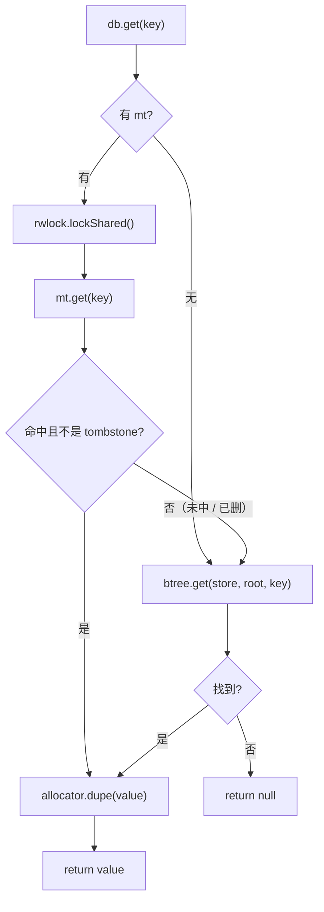

# 04 Get：memtable 优先 + B-tree 兜底

> 数据流的读路径——先查内存、未中去持久层

---

本章对应 `src/db.zig` 第 111-125 行的 `Db.get` LSM 分支，涉及 `src/memtable.zig` 的 `get` 和 `src/btree.zig` 的 `get`。

按需钻：`btree.get` 是关键下钻点，点到关键概念不逐行。

---

## 函数签名

```zig
// src/db.zig:111
pub fn get(self: *Db, key: []const u8) !?[]u8
```

参数：key 字节切片。

返回：`?[]u8`——找到返回 `allocator.dupe` 的新切片（调用方负责 `free`），找不到返回 `null`。

---

## 数据流全景

```
db.get("hello")
  │
  ├─ 1. 有 mt? → rwlock.lockShared()    // 共享锁（多个读者可同时读）
  │
  ├─ 2. mt.get(key)
  │       │
  │       ├─ 找到非 tombstone → allocator.dupe(value) → 返回 👈 高速路径
  │       │
  │       └─ 找不到 / 是 tombstone → 继续
  │
  └─ 3. btree.get(allocator, store, root, key)  // 兜底 B-tree
          │
          └─ root 页开始遍历 → 页内二分 → 找到 → dupe → 返回
```

---

## 第一步：共享锁

```zig
if (self.mt) |mt| {
    if (self.rwlock) |rw| try rw.lockShared();
    defer if (self.rwlock) |rw| rw.unlockShared();
    ...
}
```

`rwlock` 是可选（optional）的。如果有，`get` 拿**共享锁**。

**为什么需要锁？** Compaction 时会发生 `rwlock.lock()`（独占锁），把 memtable 刷到 B-tree。如果此时有读请求，共享锁会等独占锁释放；独占锁也会等所有共享锁释放。这就是**读写互斥、读读不互斥**。

**这就是 MVCC reader safety 的入口**——读者持有共享锁时，compaction 不会释放/改写正在读的数据。

---

## 第二步：Memtable get（`src/memtable.zig:74`）

```zig
pub fn get(self: *Memtable, key: []const u8) ?[]const u8 {
    const idx = self.index.get(key) orelse return null;
    const entry = &self.entries.items[idx];
    if (entry.tombstone) return null;
    return entry.value;
}
```

内部逻辑：

1. **HashMap 查找**：`index.get(key)` 用 key 的哈希找下标
2. **Tombstone 检查**：如果标记为已删除，返回 `null`（屏蔽下层 B-tree 的旧值）
3. **返回值**：返回的是 memtable 内部切片的借用（**不是拷贝**，调用方在 `Db.get` 里会 `dupe`）

> **Zig 注意**：`orelse` 是 Zig 的「如果可选值是 null 则执行后者」运算符。`entry.tombstone` 是一个 `bool` 字段，不需要 `== true`。

`Db.get` 把 `mt.get` 的返回值 dupe（分配并拷贝）一份给调用方：

```zig
if (mt.get(key)) |val| {
    return try self.allocator.dupe(u8, val);
}
```

**为什么 dupe？** memtable 内部切片在下一次 `mt.put` 后可能被回收。调用方拿到的是自己的拷贝，生命周期由调用方管理。

---

## 第三步：B-tree get 兜底（按需钻）

```zig
const root = self.state.getRoot();
return try btree.get(self.allocator, self.store, root, key);
```

如果 memtable 没命中，去持久化 B-tree 找。这是**按需钻**点——不进 btree.zig 每一行，只看关键概念。

### btree.get 做了什么

```zig
// src/btree.zig:420
pub fn get(allocator, store, root, key) !?[]u8 {
    if (root == NULL_ROOT) return null;     // 空树
    var cur = root;
    var depth = 0;
    while (depth < 1000) : (depth += 1) {
        const payload = try readNodePayload(store, cur);
        if (payload[0] == LEAF_KIND) {      // 叶节点 → 在里面找
            return findInLeaf(allocator, store, payload, key);
        } else {                            // 分支节点 → 找子页
            cur = try findInBranchPayload(payload, key);
        }
    }
    return error.Truncated;
}
```

**简单来说**：

```
while true:
    readPage(cur)           // 从 page_store 读一页
    if cur is leaf page:
        findInLeaf(key)     // 页内线性扫描 key
    else:
        cur = branchLookup(key)  // 根据 key 找子分支
```

**关键概念**：

| 概念 | 什么意思 |
|------|---------|
| `NULL_ROOT` | root = 0 表示空树，直接返回 null |
| `readNodePayload` | 调 `store.readPage(page_no)` 读页面，返回页内数据切片 |
| `LEAF_KIND` | 叶页（存实际 KV 对），分支页（存 key + 子页号） |
| `findInLeaf` | 叶页内线性扫描 entry，找匹配 key（因为单页就 32 条，O(32) 就够了） |
| `findInBranchPayload` | 分支页内二分找「应该去哪个子页」，复杂度 O(log₂64) |

**为什么 B-tree 是兜底？** 因为新写入的数据先在 memtable（内存），读时优先查内存。只有 B-tree 有的旧数据才走持久层。而且 LSM 的 compaction 会批量把 memtable 合并到 B-tree，所以 B-tree 的数据是「全量历史 + 已合并的新数据」。

---

## Mermaid：get 查找决策树



---

## 读完本章能回答

- `Db.get` 的数据流是什么？（memtable 优先 → 共享锁 → mt.get → btree.get 兜底）
- 为什么 memtable 能找到还要 dupe 返回值？（memtable 内切片生命周期受限，调用方需要自有拷贝）
- rwlock 共享锁的意义？（多个读者不互斥，compaction 独占锁时等所有读者退出）
- btree.get 的查找逻辑？（从 root 页开始，页内找 key 决定去哪个分支，直到叶页）

---

下一步：[05 Delete——tombstone 写法](05-delete.md)
