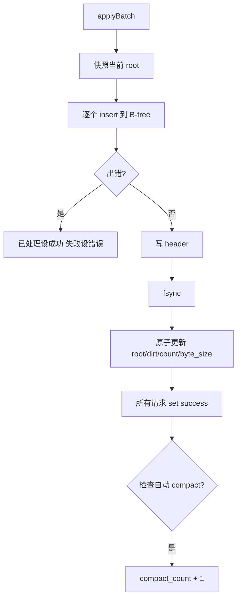

# 05 - Writer 与状态管理

## 本章目标

读完本章，你应该能：
- 理解 `writer.zig` 在写路径中的作用。
- 看懂 `applyBatch` 的完整流程。
- 理解 `State` 里每个字段的含义。
- 知道当前 MVP 和最初设计的区别。

---

## 1. writer 是做什么的？

用户调用 `db.put("k", "v")` 后，真正落到磁盘上需要几个步骤：

1. 用 COW B-tree 生成新的 root。
2. 把新节点追加到文件。
3. 写一个新的 header（提交点）。
4. 调用 `fsync` 保证数据落盘。
5. 原子更新内存里的 root 指针。

`writer.zig` 负责把这些步骤封装成 `applyBatch`。

原设计里，writer 是一个独立的协程，通过 channel 接收写请求，批量处理。但当前 MVP 为了绕开一个 zio 的嵌套 join 限制，暂时用 `zio.Mutex` 串行化。我们后面会讲这个区别。

---

## 2. 核心结构

### 2.1 Options

```zig
pub const Options = struct {
    auto_compact_dirt_ratio: ?f32 = 0.30,   // 自动 compact 垃圾比例阈值
    auto_compact_min_bytes: u64 = 16 * 1024 * 1024, // 触发自动 compact 的最小文件大小
    fsync: bool = true,                     // 是否默认 fsync
};
```

这些参数在 `Db.open` 时传入，控制写行为。

### 2.2 Request

```zig
pub const Request = struct {
    key: []const u8,
    value: []const u8,
    tombstone: bool,
    future: *zio.Future(OpResult),
};
```

一个写请求包含：
- key：要操作的 key。
- value：要写入的 value（删除时为空）。
- tombstone：是否为删除。
- future：调用方用 `zio.Future` 等待结果。

### 2.3 State

```zig
pub const State = struct {
    allocator: std.mem.Allocator,
    store: Store,
    fs: *file_store.FileStore,
    root: std.atomic.Value(u64),         // 当前 DB 层 root：0 = 空树，n = btree 偏移 + 1
    dirt: std.atomic.Value(u64),         // 垃圾字节数
    entry_count: std.atomic.Value(u64), // entry 数量
    byte_size: std.atomic.Value(u64),     // 逻辑数据量
    opts: Options,
    closed: std.atomic.Value(bool),       // 是否已关闭
    compact_count: std.atomic.Value(u32), // 自动 compact 触发次数（测试用）
};
```

这些字段都是原子值，因为读线程会并发读 `root`。

---

## 3. applyBatch 详解

```zig
pub fn applyBatch(state: *State, batch: []Request) !void
```

作用：把一批请求应用到 B-tree，生成新 root，写 header，fsync，更新状态。

流程：



### 3.1 快照当前 root

```zig
const cur_root = state.root.load(.acquire);
var bt_root: u64 = if (cur_root == 0) btree.NULL_ROOT else cur_root - 1;
```

`root` 在 DB 层是 `0 = 空树，n = btree 偏移 + 1`。传给 B-tree 时需要转换。

### 3.2 逐个 insert

```zig
for (batch, 0..) |req, i| {
    const wr = try btree.insert(state.allocator, state.store, bt_root, req.key, req.value, req.tombstone);
    bt_root = wr.new_root;
    live_delta += wr.live_delta;
    dirt_delta += wr.dirt_delta;
    count_delta += wr.count_delta;
}
```

每个请求调用一次 `btree.insert`。注意：如果某个请求失败，前面的请求已经生效了，但会尽量通知结果。

### 3.3 写 header

```zig
const new_db_root = if (bt_root == btree.NULL_ROOT) 0 else bt_root + 1;
const new_count = ...;
const new_byte = ...;
const new_dirt = ...;

_ = try file_store.appendHeaderRecord(state.fs, .{
    .btree_root = new_db_root,
    .entry_count = new_count,
    .byte_size = new_byte,
    .dirt = new_dirt,
});
```

header 记录当前版本的所有元信息。

### 3.4 fsync

```zig
if (state.opts.fsync) {
    try state.store.sync();
}
```

只有 fsync 之后，数据才算真正安全落盘。如果 `fsync = false`，崩溃时可能丢失最近一次或几次写。

### 3.5 原子更新状态

```zig
state.root.store(new_db_root, .release);
state.dirt.store(new_dirt, .release);
state.entry_count.store(new_count, .release);
state.byte_size.store(new_byte, .release);
```

注意顺序：先写 header 并 fsync，再原子更新 root。这样读线程永远看不到“header 没写但 root 已变”的中间状态。

### 3.6 通知调用方

```zig
for (batch) |req| {
    req.future.set({});
}
```

每个请求通过 `zio.Future` 通知结果。`{}` 表示成功。

---

## 4. DB 层 root 编码

btree 层有效 root 偏移可能是 0（第一个节点）。DB 层需要在 header 里区分「空树」和「偏移 0」。

规则：

- DB 层 `root`：`0` = 空树；`n > 0` = btree 偏移 + 1。
- 转换代码：

```zig
fn currentBtreeRoot(self: *Db) u64 {
    const r = self.state.root.load(.acquire);
    return if (r == 0) btree.NULL_ROOT else r - 1;
}

// 写入 header 前
const new_db_root = if (bt_root == btree.NULL_ROOT) 0 else bt_root + 1;
```

举例：
- btree 偏移 0 → DB root = 1。
- 空树 → DB root = 0。

这样就不会混淆了。

---

## 5. 自动 compact 触发

每次 `applyBatch` 成功后会检查：

```zig
if (state.opts.auto_compact_dirt_ratio) |ratio| {
    const live = new_byte;
    const total = new_dirt + live;
    if (total >= state.opts.auto_compact_min_bytes and live > 0) {
        const dirt_ratio = @as(f64, @floatFromInt(new_dirt)) / @as(f64, @floatFromInt(total));
        if (dirt_ratio >= ratio) {
            _ = state.compact_count.fetchAdd(1, .monotonic);
        }
    }
}
```

当前 MVP 只统计触发次数，不自动执行 compaction。真正的自动 compact 是后续扩展点。

---

## 6. 同步写：压测验证后的最终选择

原设计 D4 要求：
- 一个专门的 writer 协程。
- `put`/`delete` 把请求发到 mailbox channel。
- writer 批量接收请求，合并成一次 batch，写一次 header。

当前实现（压测验证后定为最终形态）：
- `db.sendRequest` 用 `zio.Mutex` 锁住 `applyBatch`。
- 每次 `put` 直接同步应用 batch，然后返回。

区别：
- 正确性一样：都是串行写，不会并发破坏数据。
- 性能不同：协程版本可以合并多个请求，减少 fsync 次数；mutex 版本每次 `put` 都 fsync。

压测结论（`bench/put_bench.zig`）：同步写 3335 ops/s，多线程因 mutex 串行不升反降。
对嵌入式 KV 足够，D4 group commit 押注关闭，mailbox/writerLoop 死代码已移除。

```zig
fn sendRequest(self: *Self, key, value, tombstone) !void {
    try self.write_mutex.lock();
    defer self.write_mutex.unlock();
    var future: zio.Future(writer.OpResult) = .init;
    var batch = [_]writer.Request{ .{ .key = key, .value = value, .tombstone = tombstone, .future = &future } };
    try writer.applyBatch(&self.state, &batch);
    const result = try future.wait();
    return result.value;
}
```

---

## 7. 本章小结

- `writer.zig` 把写请求变成“COW → header → fsync → 更新状态”的完整流程。
- `State` 是共享的写状态，所有字段都是原子的，读线程可以安全读 root。
- DB 层用 `root = btree_offset + 1` 编码来区分空树和偏移 0。
- 当前用 mutex 串行写，压测验证同步写足够后定为最终形态，D4 writer 协程押注已关闭。
- 自动 compact 目前只计数，不自动执行。

---

## 8. 本章练习

1. 在 `writer.zig` 里找到 `applyBatch`，逐行注释每个步骤。
2. 解释为什么 `applyBatch` 要先写 header、再 fsync、最后才原子更新 root？顺序能不能反过来？
3. 给 `applyBatch` 加一条测试：两个请求合并成一次 batch，验证 header 数只增加 1。
4. 在 `db.zig` 里把 `putNoFsync` 真正做成 `fsync=false` 的路径（提示：在 `applyBatch` 里按 `opts.fsync` 或请求标志决定是否 sync）。
5. 解释：如果 `root` 是 `0`，为什么 B-tree 层要把它转成 `NULL_ROOT`？
