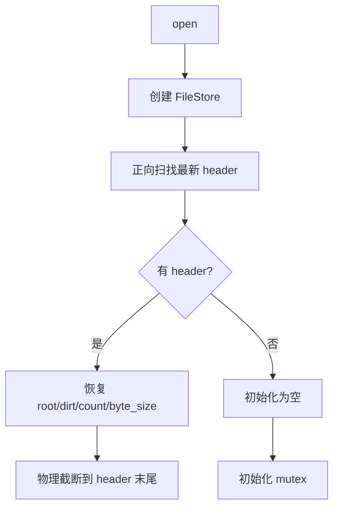

# 06 - DB 公开 API

## 本章目标

读完本章，你应该能：
- 知道 `Db` 对外提供哪些方法。
- 理解 `open` 时的恢复过程（正向扫 header）。
- 理解 `get`/`put`/`delete`/`select` 的内部流程。
- 理解 group commit（leader/follower）并发模型。

---

## 1. Db 是什么？

`Db` 是 `cube_db` 对外暴露的核心对象。调用方通过它操作数据库：

```zig
pub const Db = struct {
    allocator: std.mem.Allocator,
    fs: file_store.FileStore,
    store: Store,
    state: writer.State,
    write_mutex: zio.Mutex,
    path: []u8,
};
```

`Db` 内部持有：
- `allocator`：分配内存，调用方负责 `get` 返回值的 free。
- `fs` / `store`：底层文件存储（FileStore 含 mmap，见第 03 章）。
- `state`：写状态（root、dirt、count 等）。
- `write_mutex`：leader 持有，串行化 `applyBatch`。
- `queue_mutex`：保护 group commit 的 `write_queue` + `has_leader`。
- `write_queue` / `has_leader`：group commit 的待合并队列 + leader 身份标志（见 §5）。
- `path`：数据文件路径。

> 上面结构字段略写了（部分未列出），重点是：除了原来的 `write_mutex`，还多了 group commit 用的 `queue_mutex`/`write_queue`/`has_leader`。

---

## 2. 公开 API 一览

```zig
pub const Db = struct {
    pub fn open(allocator, path, opts) !*Db;
    pub fn close(self: *Db) !void;
    pub fn get(self: *Db, key: []const u8) !?[]u8;
    pub fn put(self: *Db, key: []const u8, value: []const u8) !void;
    pub fn putNoFsync(self: *Db, key: []const u8, value: []const u8) !void;
    pub fn delete(self: *Db, key: []const u8) !void;
    pub fn select(self: *Db, min: ?[]const u8, max: ?[]const u8) !btree.Iterator;
    pub fn compact(self: *Db) !void;
};
```

所有方法都是**同步 API**，可以在任意线程调用。内部通过 zio 的阻塞降级机制完成文件 IO。

- 读路径：mmap 零拷贝（见第 03/04 章）。
- 写路径：group commit（leader/follower）合并并发写（见 §5）。

---

## 3. open：打开或创建数据库

```zig
pub fn open(allocator, path, opts) !*Db
```

流程：



### 3.1 创建 FileStore

```zig
self.fs = try file_store.FileStore.create(allocator, path);
self.store = self.fs.store();
```

如果文件不存在，`create` 会创建；如果存在，会打开。

### 3.2 正向扫描找最新 header

```zig
const scan = try store_mod.getLatestHeader(allocator, self.store);
```

`getLatestHeader` 从文件头 offset=0 开始，按记录长度一条条往后走，记住最后一个「magic + version 对、CRC 也对」的 header 记录。遇到坏记录（CRC 错或长度越界，多半是崩溃时写了一半）就停。所以拿到的是「最新有效提交点」。

如果文件空、或一条有效 header 都没有，返回 `null`，说明是空数据库。详见第 08 章。

### 3.3 恢复状态

```zig
if (scan) |s| {
    cur_root = s.header.btree_root;
    cur_dirt = s.header.dirt;
    cur_count = s.header.entry_count;
    cur_byte = s.header.byte_size;

    // 截断到 header 末尾，去掉尾部垃圾
    const header_end_logical = s.record_logical_offset + f.recordTotalSize(f.HEADER_PAYLOAD_SIZE);
    const cur_size = try self.store.size();
    if (cur_size > header_end_logical) {
        try self.store.setSize(header_end_logical);
    }
}
```

为什么要截断？因为崩溃时可能有些写了一半的节点在 header 后面。截断后，文件末尾永远是最新有效 header，下次 append 位置不会歧义。

### 3.4 初始化 State

```zig
self.state = .{
    .allocator = allocator,
    .store = self.store,
    .fs = &self.fs,
    .root = std.atomic.Value(u64).init(cur_root),
    .dirt = std.atomic.Value(u64).init(cur_dirt),
    .entry_count = std.atomic.Value(u64).init(cur_count),
    .byte_size = std.atomic.Value(u64).init(cur_byte),
    .opts = opts,
    .closed = std.atomic.Value(bool).init(false),
    .compact_count = std.atomic.Value(u32).init(0),
};
```

所有状态从 header 恢复。

---

## 4. get：读一个 key

```zig
pub fn get(self: *Self, key: []const u8) !?[]u8 {
    const bt_root = self.currentBtreeRoot();
    return btree.get(self.allocator, self.store, bt_root, key);
}
```

读流程：
1. 原子读 `state.root`。
2. 转成 B-tree root（0 或 NULL_ROOT）。
3. `btree.get` 沿树下行，找到 value 后复制一份返回。

注意：返回值是 `db.allocator` 分配的，调用方必须 `db.allocator.free(v)`。

读是无锁的。因为 root 指针一旦确定，指向的 B-tree 就是不可变的，读过程中不需要加锁。

---

## 5. put / delete：写操作（group commit）

```zig
pub fn put(self: *Db, key: []const u8, value: []const u8) !void {
    return self.sendRequest(key, value, false);
}

pub fn delete(self: *Db, key: []const u8) !void {
    return self.sendRequest(key, "", true);
}
```

内部统一走 `sendRequest`，**核心是 group commit（leader/follower）合并并发写**：

```zig
fn sendRequest(self, key, value, tombstone) !void {
    var future: zio.Future(writer.OpResult) = .init;
    const req: writer.Request = .{ .key = key, .value = value, .tombstone = tombstone, .future = &future };

    // 1. 入队 + leader 选举（queue_mutex 保护 has_leader + write_queue）
    try self.queue_mutex.lock();
    self.write_queue.append(self.allocator, req) catch ...;
    if (self.has_leader) {
        // 已经有 leader 了 → 我当 follower：req 已在队列，解锁、等 leader 唤醒
        self.queue_mutex.unlock();
        const result = try future.wait();  // 阻塞等 leader 处理完
        return result.value;
    }
    self.has_leader = true; // 没有 leader → 我当 leader
    self.queue_mutex.unlock();

    // 2. leader：持 write_mutex，循环清空队列 + applyBatch，直到队列空
    try self.write_mutex.lock();
    defer self.write_mutex.unlock();
    defer leaderReset(self); // 错误路径让出 leader 身份，防 follower 死等
    while (true) {
        try self.queue_mutex.lock();
        const batch = self.write_queue.toOwnedSlice(self.allocator) catch ...;
        if (batch.len == 0) { self.has_leader = false; self.queue_mutex.unlock(); break; }
        self.queue_mutex.unlock();
        writer.applyBatch(&self.state, batch) catch ...; // 1 次 fsync 处理整批
        self.allocator.free(batch);
    }
    // leader 自己的 req 已被某批 applyBatch set，等结果
    const result = try future.wait();
    return result.value;
}
```

机制要点：
- **leader**：拿到写锁后，把队列里所有请求（包括 follower 刚塞进来的）一次 `applyBatch`（1 次 fsync），然后继续清空队列直到空才卸任。
- **follower**：只入队 + 阻塞等 `Future`，leader 在 `applyBatch` 里会 set 所有请求的 future，follower 被唤醒。
- **合并效果**：16 线程 × 50 put（800 个写）实测只产生 ~117 次 fsync（合并 ~6.8×）。
- **错误路径**：leader 任何出错都经 `defer leaderReset` 让出 leader 身份，防 follower 死等。

`putNoFsync` 当前行为与 `put` 一致（都走 group commit + fsync），代码里留了注释说明这是未来要补的优化。

---

## 6. select：范围查询

```zig
pub fn select(self: *Self, min: ?[]const u8, max: ?[]const u8) !btree.Iterator {
    const bt_root = self.currentBtreeRoot();
    return btree.select(self.allocator, self.store, bt_root, min, max);
}
```

- `min` 和 `max` 可以是 `null`，表示无界。
- 返回的是 `Iterator`，必须调用 `iter.deinit()` 释放。
- 迭代器看到的是创建时的快照。即使期间有 `put`/`compact`，迭代结果不变。

使用示例：

```zig
var it = try db.select("apple", "banana");
defer it.deinit();
while (try it.next()) |e| {
    std.debug.print("{s} = {s}\n", .{ e.key, e.value });
}
```

---

## 7. close：关闭数据库

```zig
pub fn close(self: *Self) !void {
    self.state.closed.store(true, .release);
    self.store.sync() catch {};
    self.fs.close();
    self.allocator.free(self.path);
    self.allocator.destroy(self);
}
```

注意：
- 即使 `sync` 失败也释放资源，避免内存泄漏。
- `close` 会把 `Db` 占用的内存全部释放。
- `close` 之后不能再使用 `db` 指针。

---

## 8. 并发模型

读：
- 任意线程可以同时读。
- 读只读 `state.root` 原子值，然后沿不可变树下行（mmap 零拷贝）。
- 不需要加锁。

写：
- 走 **group commit（leader/follower）**：多个并发 `put` 自动合并成一次 `applyBatch`（1 次 fsync）。第一个来的当 leader 持写锁清空队列，后来的当 follower 入队等唤醒。
- leader 与 putBatch/compact 仍由 `write_mutex` 串行，任意时刻只有一个写。
- 读和写互不阻塞。

为什么读不会看到中间状态？因为 root 指针只在 header 落盘并 fsync 后才更新。写一半时，读线程仍然看到旧 root，沿旧树下行看到一致快照（append-only 天然 MVCC）。

---

## 9. 本章小结

- `Db` 是公开 API 入口，封装了 `Store`、`B-tree`、`Writer`。
- `open` 从 header 恢复状态（正向扫记录找最新 header），并截断尾部垃圾。
- `get`/`select` 是无锁读，基于不可变 B-tree + mmap 零拷贝。
- `put`/`delete` 走 group commit（leader/follower），多个并发写合并成 1 次 fsync。
- `close` 负责释放所有资源，即使 sync 失败也不泄漏。

---

## 10. 本章练习

1. 在 `tests/db_test.zig` 里找到 `withDb` 函数，解释它为什么能直接用同步 API 创建 `Db`。
2. 写一个测试：打开数据库，put 一个 key，close，重新 open，get 同一个 key，验证数据还在。
3. 在 `db.zig` 里加 `getCopy` 方法：返回值由调用方 allocator 分配，而不是 `db.allocator`。
4. 给 `select` 写一个测试：迭代期间同时 `put` 新 key，验证迭代器仍看到旧快照。
5. 解释：为什么 `Db.open` 要截断到最新 header 末尾？如果不截断会发生什么？
