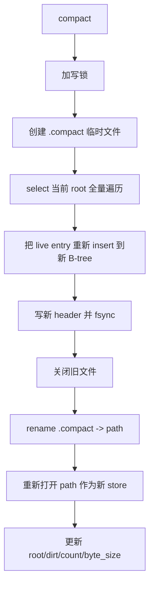

# 07 - Compaction

## 本章目标

读完本章，你应该能：
- 理解为什么需要 compaction。
- 理解 `cube_db` 的 compaction 是怎么做的。
- 知道 compaction 的限制和注意事项。

---

## 1. 为什么需要 compaction？

回顾 COW B-tree：每次写都会生成新的节点，旧节点不会被删除。比如连续修改同一个 key 100 次，会产生 100 个旧版本的 leaf 和 100 个旧版本的 root。

这些旧版本节点占用的空间就是 **垃圾（dirt）**。`dirt` 字段会不断增长。

如果永远不回收，磁盘会被占满。所以需要 compaction：
- 把当前所有“活着”的 key-value 读出来。
- 按 key 顺序重新构建一棵紧凑的 B-tree。
- 写到新文件，然后切换过去。
- 旧文件被删除，垃圾空间释放。

---

## 2. 触发条件

目前 `cube_db` 支持两种触发：

1. **手动触发**：调用 `db.compact()`。
2. **自动触发标记**：`writer.applyBatch` 会检查 `dirt / (dirt + live) >= 阈值`，如果满足就增加 `compact_count` 计数。但当前 MVP 不会自动执行 compaction，只是标记一下。

自动 compact 的阈值参数：

```zig
pub const Options = struct {
    auto_compact_dirt_ratio: ?f32 = 0.30,   // 垃圾比例达到 30% 触发
    auto_compact_min_bytes: u64 = 16 * 1024 * 1024, // 文件至少 16MB 才触发
    fsync: bool = true,
};
```

---

## 3. 全量重建流程

`cube_db` 的 compaction 是“全量重建”：把所有 live 数据读出来，再写一遍。

流程：



### 3.1 加写锁

```zig
try self.write_mutex.lock();
defer self.write_mutex.unlock();
```

compaction 期间禁止新的 `put`/`delete`。

### 3.2 创建临时文件

```zig
const compact_path = try std.fmt.allocPrint(allocator, "{s}.compact", .{self.path});
var new_fs = try file_store.FileStore.create(allocator, compact_path);
```

先写到一个 `.compact` 文件，避免破坏原文件。

### 3.3 遍历 live 数据

```zig
var it = try btree.select(allocator, self.store, bt_root, null, null);
defer it.deinit();
while (try it.next()) |e| {
    new_bt_root = (try btree.insert(allocator, new_store, new_bt_root, e.key, e.value, false)).new_root;
    entry_count += 1;
    live_bytes += e.key.len + e.value.len + 9;
}
```

`select(null, null)` 遍历全部数据，跳过 tombstone。每个 live entry 重新 insert 到新 B-tree。

### 3.4 写新 header 并 fsync

```zig
_ = try file_store.appendHeaderRecord(&new_fs, .{
    .btree_root = if (new_bt_root == btree.NULL_ROOT) 0 else new_bt_root + 1,
    .entry_count = entry_count,
    .byte_size = live_bytes,
    .dirt = 0,
});
try new_store.sync();
```

新文件 compact 后，`dirt = 0`，因为所有节点都是当前版本，没有垃圾。

### 3.5 切换文件

```zig
self.fs.close();
try cwd.rename(compact_path, cwd, self.path);
self.fs = try file_store.FileStore.create(allocator, self.path);
self.store = self.fs.store();
self.state.store = self.store;
self.state.fs = &self.fs;
```

- 关闭旧文件描述符。
- 用 `rename` 把 `.compact` 文件变成正式数据文件。
- 重新打开新的数据文件。

### 3.6 更新内存状态

```zig
self.state.root.store(if (new_bt_root == btree.NULL_ROOT) 0 else new_bt_root + 1, .release);
self.state.dirt.store(0, .release);
self.state.entry_count.store(entry_count, .release);
self.state.byte_size.store(live_bytes, .release);
```

状态更新后，新的写操作使用新文件和新 root。

---

## 4. 为什么这种 compaction 是安全的？

| 崩溃阶段 | 结果 |
|----------|------|
| `.compact` 没写完 | 原文件还在，不受影响 |
| `.compact` 写完了但 rename 前崩溃 | 残留 `.compact`，原文件仍可用 |
| rename 后崩溃 | 新文件已经 fsync，完整可用 |

关键点：
- 原文件在 compaction 过程中**只读不写**，所以不可能被损坏。
- `.compact` 文件是临时文件，随时可以丢弃。
- 新文件写完后先 `fsync`，再 `rename`。

MVP 跳过了父目录 fsync（DESIGN 已注明），生产环境需要补上。

---

## 5. 限制

当前 compaction 的限制：

1. **写停顿**：compaction 期间所有写被锁阻塞。数据量越大，停顿越久。
2. **全量重建**：把所有数据读出来再写一遍，成本高。
3. **单文件**：不能分片或增量 compact。
4. **父目录 fsync 未实现**：极端情况下 rename 可能丢失。

这些都是 CubDB 的简化版，后续可以增量 compact、后台 compact 等。

---

## 6. 本章测试

`tests/compact_test.zig` 有两条测试：

1. `manual compact keeps data`：写 50 条，compact，再读全部 50 条。
2. `compact then reopen`：compact 后关闭，重开验证数据还在。

---

## 7. 本章小结

- compaction 回收 COW 产生的旧版本节点。
- 当前实现是全量重建 + 临时文件 + rename 切换。
- 原文件在 compaction 期间只读，所以安全。
- MVP 简单但有写停顿，适合小数据量场景。

---

## 8. 本章练习

1. 在 `tests/compact_test.zig` 加一条：连续覆盖同一个 key 100 次，compact 后文件大小应该明显变小。
2. 给 `compact` 加 dirt 比例检查：如果 dirt 比例低于 10%，直接返回不做。
3. 在 compact 结束后，如果 `.compact` 残留文件存在，删除它。
4. 解释：为什么新文件写完后要先 `fsync`，再 `rename`？如果顺序反过来会有什么风险？
5. 思考：如果 compaction 期间有读迭代器在跑，旧文件被 close 后读会不会出错？（提示：当前实现没有 reader refcount）
