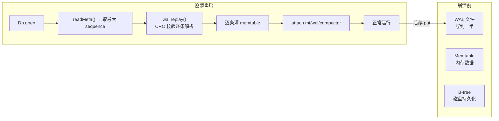

# 07 Recovery：WAL replay 与调用方职责

> 崩溃后怎么恢复？WAL 回放把丢失的 memtable 重建回来

---

本章对应 `src/wal.zig` 的 `replay` 函数（第 128 行起）。

---

## 谁需要 Recovery？

LSM 的数据在崩溃前有两个位置：

| 数据位置 | 崩溃后 | 恢复方式 |
|----------|--------|----------|
| B-tree（磁盘）| **安全** | meta 页两页交替，O(1) 恢复 |
| Memtable（内存）| **丢失** | 需要 WAL replay 重建 |
| WAL（磁盘）| **安全** | replay 读出来灌回 memtable |

崩溃后数据一致性的保证：

```
崩溃前：
  WAL:   [put a=1][put b=2][put c=3]    ← 已写磁盘
  Memtable: {a→1, b→2, c→3}            ← 已从 WAL dupe 过来
  B-tree: [旧数据]                       ← 数据已存在，但缺 {a,b,c}

崩溃→重启：
  1. open → 读 meta → B-tree 恢复（缺 {a,b,c}，这些在旧 WAL 里）
  2. 调用方 wal.replay() → [put a=1][put b=2][put c=3] ← 原样读出
  3. 调用方把这些重新灌进 memtable
  4. 或者直接 applyBatch 到 B-tree（但就绕过了 memtable 的延迟写优势）
```

---

## Wal.replay（`src/wal.zig:128`）

```zig
pub fn replay(self: *Wal) ![]Entry
```

返回：堆分配的 `[]Entry`（调用方负责 `free` 每个 entry 的 key/value 和 slice 本身）。

### 内部实现

```zig
// 读整个文件 payload（跳过 12 字节头）
const file_size = c.lseek(self.fd, 0, c.SEEK_END);
const payload_len: usize = @intCast(file_size - 12);
const buf = try self.allocator.alloc(u8, payload_len);
_ = c.pread(self.fd, buf.ptr, buf.len, 12);

// 逐条解析
var offset: usize = 0;
while (offset + 9 <= buf.len) {
    const type_byte = buf[offset];          // 0=put, 1=delete
    const key_len = readInt(u32, buf[offset+1..], .little);
    const val_len = readInt(u32, buf[offset+5..], .little);

    // 长度合理性检查（防止坏数据引起巨大分配）
    if (key_len > 1_000_000 or val_len > 100_000_000) break;

    const entry_size = 9 + key_len + val_len + 4;
    if (offset + entry_size > buf.len) break;

    // CRC32 校验
    var crc = std.hash.Crc32.init();
    crc.update(buf[offset .. offset + 9]);  // hdr
    crc.update(buf[offset + 9 .. offset + 9 + key_len]);          // key
    crc.update(buf[offset + 9 + key_len .. offset + 9 + key_len + val_len]);  // value
    const computed_crc = crc.final();
    const stored_crc = readInt(u32, buf[offset + entry_size - 4 ..], .little);

    if (computed_crc != stored_crc) {
        offset += 1;  // CRC 不匹配 → 跳过 1 字节，尝试后移恢复
        continue;
    }

    // CRC 通过 → 提取 key/value
    const key = try allocator.dupe(u8, buf[offset + 9 .. offset + 9 + key_len]);
    const value = try allocator.dupe(u8, buf[offset + 9 + key_len .. offset + 9 + key_len + val_len]);

    try entries.append(allocator, Entry{
        .entry_type = @as(EntryType, @enumFromInt(type_byte & 0x01)),
        .key = key,
        .value = value,
    });

    offset += entry_size;
}
```

**关键设计决策**：

| 决策 | 为什么 |
|------|--------|
| 读整个文件 | 简单。WAL 文件通常很小（设了阈值就 flush+truncate） |
| 长度上限保护 | 防止损坏的 key_len 引起 OOM |
| CRC 错误时 offset+=1 | 尝试跳过坏字节恢复下一条，而不是放弃整个文件 |
| 只取 type_byte & 0x01 | 只认最低位，其他 flags 未来用 |

---

## 为什么 `Db.open` 不调 `replay`

这是 cube_db 设计中的一个**显式选择**：open 不碰 WAL。

```zig
// src/db.zig:35 — Db.open 完全不碰 wal/replay
pub fn open(allocator, store, opts) !*Db {
    const state = try allocator.create(State);
    state.* = State.init(allocator, store, opts);
    if (try store.readMeta()) |meta| {
        state.root.store(meta.root_page, .release);
        // ... 灌 sequence, entry_count, byte_size
    }
    // 不建 mt, 不调 wal.replay(), 不启动 compactor
    const db = .{ .state = state, .store = store, ... };
    return db;
}
```

**原因**：

1. **解耦**——`Db` 不知道 LSM 组件存在。LSM 字段全是 optional
2. **生命周期**——`Wal` 由调用方创建和管理，`Db.open` 无权调它的 `replay`
3. **策略选择**——replay 后的数据可以灌 memtable（恢复 LSM 路径），也可以直接 `applyBatch` 到 B-tree（退化到 COW）。`Db.open` 不替你选

### 调用方的职责

完整的 LSM 启动序列应该是：

```zig
var ms = MemPageStore.init(allocator, 1 << 20);
var db = try Db.open(allocator, ms.store(), .{});

// 1. 打开 WAL
var wal = try Wal.init(allocator, ".wal");
// 2. 创建 memtable
var mt = Memtable.init(allocator, 1 << 20);

// 3. WAL replay（恢复上次崩溃时未 flush 的数据）
const entries = try wal.replay();
for (entries) |e| {
    switch (e.entry_type) {
        .put => _ = try mt.put(e.key, e.value),
        .delete => _ = try mt.delete(e.key),
    }
}
// （记得 free 掉 entries）

// 4. 现在 attach
db.mt = &mt;
db.wal = &wal;

// 5. （可选）启动 compactor
var compactor = Compactor.init(allocator, db.state, &wal, &rwlock);
try compactor.start();
```

---

## 对比 COW O(1) 恢复

COW 路径的 recovery 就是 `Db.open` 的 `readMeta()`：

```
COW recovery:
  open → readMeta → 取 sequence 大的 meta 页 → 从 root_page 开始读 B-tree
  → 两页读取（8KB），无扫描，O(1)

LSM recovery:
  open → readMeta（恢复 B-tree）
  + 调用方 replay WAL → 逐条解析 → 灌 memtable
  → O(N) 相对于 WAL 中的条目数
```

COW 恢复快但等于放弃未 flush 的数据（它不需要 WAL，因为每步都直接写 B-tree）。LSM 有 replay 开销，但恢复的数据不丢（memtable 里的写入都能重放）。

---

## Mermaid：恢复流程



---

## 读完本章能回答

- 崩溃后哪些数据在哪些不在？（B-tree 安全，memtable 丢，WAL 安全可 replay）
- `wal.replay()` 怎么解析条目？（跳过 12B header，逐条读 type/key_len/val_len/key/val/crc32，CRC 校验通过才接受）
- CRC 错误怎么办？（跳过 1 字节尝试恢复，而不是放弃整个文件）
- 为什么 `Db.open` 不调 `replay`？（解耦：Db 不知 LSM 存在；生命周期：Wal 是调用方的；策略：replay 后灌 memtable 或 applyBatch 由调用方选）
- 完整的 LSM 启动序列是什么？（open → wal.init → mt.init → wal.replay → 灌 mt → attach → compactor.start）

---

下一步：[08 串联 + 修改练习](08-wrapup.md)
