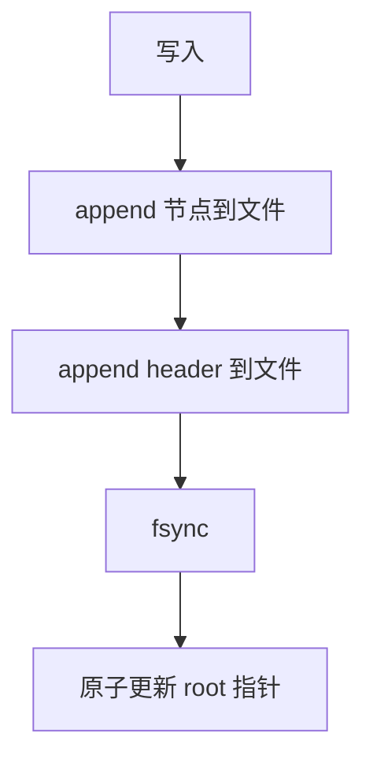

# 08 - 崩溃安全

## 本章目标

读完本章，你应该能：
- 理解 `cube_db` 如何保证崩溃时数据不损坏。
- 理解 header 作为提交点的作用。
- 理解启动恢复时的正向扫描和 CRC 回退。
- 看懂 `fault_store.zig` 的测试。

---

## 1. 崩溃安全要解决什么问题？

数据库最怕两件事：

1. **数据丢失**：我还没 `fsync`，进程就崩了，这部分数据可以丢，但文件不能坏。
2. **文件损坏**：写到一半断电，文件结构混乱，重启后打不开。

`cube_db` 的设计目标是：
- 已 `fsync` 的写不丢。
- 文件永远不会坏，最坏情况是回退到上一个有效版本。

---

## 2. 核心机制：header 是提交点

每次写操作的流程：



关键点：
- 新节点写完后，必须再写一个 header。
- 只有 header 写成功并 fsync 后，这次写才对后续读可见。
- 如果 header 没写或没 fsync，这次写就像没发生过。

可以把 header 理解为“发票”：你买东西时，商品（节点）先放到仓库，但只有发票（header）签收了，这次交易才生效。

---

## 3. 为什么 append-only 能防崩溃？

因为 append-only 不修改旧数据。即使崩溃时新 header 只写了一半，旧 header 仍然完好无损。

几种场景：

| 场景 | 结果 |
|------|------|
| 节点写一半崩溃 | 没有新 header，旧数据完整 |
| header 写一半崩溃 | 新 header CRC 失败，回退到旧 header |
| fsync 前断电 | 未 fsync 的数据可能丢失，但文件结构合法 |
| compaction 中崩溃 | 原文件未动，.compact 可丢弃 |

---

## 4. 启动恢复：getLatestHeader（正向扫描）

`src/store.zig` 的 `getLatestHeader` 负责启动时找到最新的有效 header。

流程：从文件头 offset=0 开始，按记录长度一条条往后走，记住最后一个有效的 header 记录，遇到坏记录就停。

```mermaid
graph TD
    A[从 offset=0 开始] --> B[读 len(4)]
    B --> C[借整记录 readBorrow]
    C --> D[decodeRecord CRC OK?]
    D -->|否| G[停，返最后一个有效 header]
    D -->|是| E{是 header?<br/>magic+version 对}
    E -->|是| F[记住这个 header]
    E -->|否| H[继续下一条]
    F --> H
    H --> B
    G --> I{有记住的?}
    I -->|是| J[返回 header]
    I -->|否| K[返回 null 空库]
```

### 4.1 正向扫描

```zig
var off: u64 = 0;
while (off < total) {
    const len_slice = store.readBorrow(off, 4) catch break;
    if (len_slice.len < 4) break;
    const payload_len = std.mem.readInt(u32, len_slice[0..4], .big);
    const rec_total = f.REC_LEN_SIZE + payload_len + f.REC_CRC_SIZE;
    if (off + rec_total > total) break; // 整记录越界 → crash 半写，停
    const rec = store.readBorrow(off, rec_total) catch break;
    const payload = f.decodeRecord(rec) catch break; // CRC 错则停
    if (payload.len >= f.HEADER_PAYLOAD_SIZE) {
        const h = f.decodeHeaderPayload(payload[0..f.HEADER_PAYLOAD_SIZE]);
        if (h.magic == f.MAGIC and h.version == f.VERSION) {
            last = .{ .record_logical_offset = off, .header = h }; // 记住
        }
    }
    off += rec_total; // 下一条记录
}
return last;
```

关键点：
- 记录是连续的，靠 `len` 字段知道每条多长，一条接一条跳过去。
- 中间混有 B-tree 节点记录（不是 header），扫到时 `decodeRecord` 能解出来，但它 magic/version 不是 header，跳过；只记住 header。
- 遇到坏记录（CRC 错 / 长度越界，多半是崩溃时写了一半）就停，返回之前记住的最后一个 header。

### 4.2 校验

每条记录都走 `decodeRecord` 验 CRC。header 还额外检查 `magic == MAGIC` 和 `version == VERSION`，防止把别的记录误当 header。

### 4.3 物理截断

`Db.open` 找到最新 header 后，会把文件截断到 header 末尾：

```zig
const header_end_logical = s.record_logical_offset + f.recordTotalSize(f.HEADER_PAYLOAD_SIZE);
const cur_size = try self.store.size();
if (cur_size > header_end_logical) {
    try self.store.setSize(header_end_logical);
}
```

这样下次 append 时，位置紧跟最新 header，不会写到旧垃圾上。

> **历史**：以前有 marker 时，`getLatestHeader` 是从文件末尾「按块倒扫 marker」找 `MARKER_HEADER`。去 marker 后改成正向扫记录，代码反而更简单（不用管 marker 跳跃），且 crash 半写的尾部坏记录会被自动跳过。

---

## 5. fsync 的作用

操作系统通常会把写操作缓存起来，不会立刻落盘。`fsync` 强制把缓存刷到磁盘。

```zig
if (state.opts.fsync) {
    try state.store.sync();
}
```

- `fsync = true`（默认）：`put` 返回时数据已经在磁盘上，崩溃不丢。
- `fsync = false`：`put` 返回更快，但崩溃可能丢失最近几次写。

`cube_db` 默认开启 fsync，安全优先。

---

## 6. FaultStore：测试崩溃

`src/fault_store.zig` 用内存 Store 模拟各种故障。

配置：

```zig
pub const FaultConfig = struct {
    fail_after_bytes: ?usize = null,  // 写入 N 字节后返回 InjectedIoError
    truncate_to: ?usize = null,      // 把底层物理文件截断到某长度
};
```

测试场景：

1. **节点写一半崩溃**：追加一个旧 header，再追加一些垃圾节点字节，没有新 header。恢复后仍读旧 header。
2. **header 撕裂**：最后一个 header 的 payload 被改一个字节，CRC 失败，回退上一个 header。
3. **fsync=false 丢失**：尾部截断，恢复后可能丢最近写，但文件合法。
4. **compaction 中崩溃**：原文件不动，恢复后原数据可用。
5. **rename 完成**：新文件完整可用。

这些测试让崩溃场景可以重复验证，而不需要真的拔电源。

---

## 7. 本章小结

- header 是提交点，只有 header 成功写入并 fsync 后，写才可见。
- append-only 保证旧 header 不被覆盖，崩溃时可以回退。
- `getLatestHeader` **正向扫记录**，记住最后一个有效 header；遇到坏记录（CRC 错/越界）就停，自动回退。
- `fsync` 决定安全级别，默认开启。
- `FaultStore` 让崩溃场景可以单元测试。

---

## 8. 本章练习

1. 在 `src/store.zig` 里找到 `getLatestHeader`，逐行注释它的正向扫描逻辑。
2. 写一条测试：先写一个好 header，再追加一些合法的 node 记录，再写第二个 header，验证 `getLatestHeader` 返回第二个（中间的 node 记录被跳过）。
3. 写一条测试：写两个 header 后，破坏最后一个 header 的 payload 字节让 CRC 失败，验证 `getLatestHeader` 回退到第一个。
4. 解释：如果 `fsync = false`，一次 `put` 成功后立即断电，可能丢失多少数据？是最近一次，还是所有未 fsync 的写？
5. 思考：去 marker 后，`getLatestHeader` 为什么不需要「按块跳 marker」了？（提示：记录连续，靠 len 字段一条条跳，逻辑==物理。）
