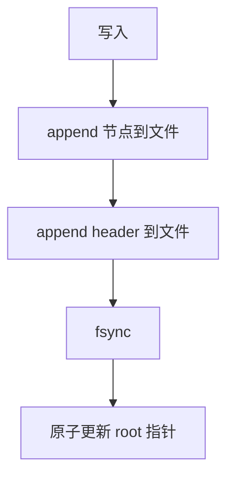

# 08 - 崩溃安全

## 本章目标

读完本章，你应该能：
- 理解 `cube_db` 如何保证崩溃时数据不损坏。
- 理解 header 作为提交点的作用。
- 理解启动恢复时的反向扫描和 CRC 回退。
- 看懂 `fault_store.zig` 的测试。

---

## 1. 崩溃安全要解决什么问题？

数据库最怕两件事：

1. **数据丢失**：我还没 `fsync`，进程就崩了，这部分数据可以丢，但文件不能坏。
2. **文件损坏**：写到一半断电，文件结构混乱，重启后打不开。

`cube_db` 的设计目标是：
- 已 `fsync` 的写不丢。
- 文件永远不会坏，最坏情况是回退到上一个有效版本。

---

## 2. 核心机制：header 是提交点

每次写操作的流程：



关键点：
- 新节点写完后，必须再写一个 header。
- 只有 header 写成功并 fsync 后，这次写才对后续读可见。
- 如果 header 没写或没 fsync，这次写就像没发生过。

可以把 header 理解为“发票”：你买东西时，商品（节点）先放到仓库，但只有发票（header）签收了，这次交易才生效。

---

## 3. 为什么 append-only 能防崩溃？

因为 append-only 不修改旧数据。即使崩溃时新 header 只写了一半，旧 header 仍然完好无损。

几种场景：

| 场景 | 结果 |
|------|------|
| 节点写一半崩溃 | 没有新 header，旧数据完整 |
| header 写一半崩溃 | 新 header CRC 失败，回退到旧 header |
| fsync 前断电 | 未 fsync 的数据可能丢失，但文件结构合法 |
| compaction 中崩溃 | 原文件未动，.compact 可丢弃 |

---

## 4. 启动恢复：getLatestHeader

`src/store.zig` 的 `getLatestHeader` 负责启动时找到最新的有效 header。

流程：


### 4.1 反向扫描

从文件最后一个块开始，向前扫描每个块首的 marker：

```zig
var block_index: u64 = num_blocks;
while (block_index > 0) {
    block_index -= 1;
    const marker_phys = block_index * f.BLOCK_SIZE;
    const n = try store.readPhysical(&marker_buf, marker_phys);
    if (n != 1) continue;
    if (marker_buf[0] != f.MARKER_HEADER) continue;
    // 尝试读这个 header 记录
}
```

### 4.2 校验

找到 marker 后，读取 marker 后面的记录：

```zig
var rec_buf: [64]u8 = undefined;
const rn = try store.readPhysical(&rec_buf, marker_phys + 1);
const payload = f.decodeRecord(rec_buf[0..rn]) catch continue;
const h = f.decodeHeaderPayload(payload[0..f.HEADER_PAYLOAD_SIZE]);
if (h.magic != f.MAGIC) continue;
if (h.version != f.VERSION) continue;
```

如果 CRC 失败、magic 不对、version 不对，都跳过这个 header，继续往前找。

### 4.3 物理截断

`Db.open` 找到最新 header 后，会把文件截断到 header 末尾：

```zig
const header_end_logical = s.record_logical_offset + f.recordTotalSize(f.HEADER_PAYLOAD_SIZE);
const cur_size = try self.store.size();
if (cur_size > header_end_logical) {
    try self.store.setSize(header_end_logical);
}
```

这样下次 append 时，位置紧跟最新 header，不会写到旧垃圾上。

---

## 5. fsync 的作用

操作系统通常会把写操作缓存起来，不会立刻落盘。`fsync` 强制把缓存刷到磁盘。

```zig
if (state.opts.fsync) {
    try state.store.sync();
}
```

- `fsync = true`（默认）：`put` 返回时数据已经在磁盘上，崩溃不丢。
- `fsync = false`：`put` 返回更快，但崩溃可能丢失最近几次写。

`cube_db` 默认开启 fsync，安全优先。

---

## 6. FaultStore：测试崩溃

`src/fault_store.zig` 用内存 Store 模拟各种故障。

配置：

```zig
pub const FaultConfig = struct {
    fail_after_bytes: ?usize = null,  // 写入 N 字节后返回 InjectedIoError
    truncate_to: ?usize = null,      // 把底层物理文件截断到某长度
};
```

测试场景：

1. **节点写一半崩溃**：追加一个旧 header，再追加一些垃圾节点字节，没有新 header。恢复后仍读旧 header。
2. **header 撕裂**：最后一个 header 的 payload 被改一个字节，CRC 失败，回退上一个 header。
3. **fsync=false 丢失**：尾部截断，恢复后可能丢最近写，但文件合法。
4. **compaction 中崩溃**：原文件不动，恢复后原数据可用。
5. **rename 完成**：新文件完整可用。

这些测试让崩溃场景可以重复验证，而不需要真的拔电源。

---

## 7. 本章小结

- header 是提交点，只有 header 成功写入并 fsync 后，写才可见。
- append-only 保证旧 header 不被覆盖，崩溃时可以回退。
- `getLatestHeader` 反向扫描 marker，CRC 失败就往前找。
- `fsync` 决定安全级别，默认开启。
- `FaultStore` 让崩溃场景可以单元测试。

---

## 8. 本章练习

1. 在 `src/store.zig` 里找到 `getLatestHeader`，逐行注释它的逻辑。
2. 写一条测试：先写一个好 header，再追加一个 CRC 故意错误的“假 header”，验证 `getLatestHeader` 回退到第一个好 header。
3. 在 `Db.open` 里，如果 `.compact` 文件存在，尝试删除它。
4. 解释：如果 `fsync = false`，一次 `put` 成功后立即断电，可能丢失多少数据？是最近一次，还是所有未 fsync 的写？
5. 思考：为什么 header 块必须从块首开始？如果 header 可以跨块会有什么麻烦？
