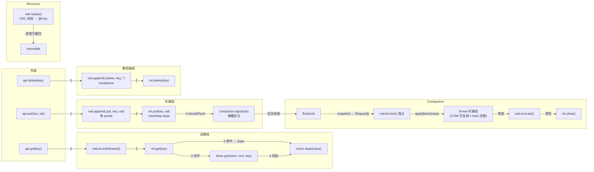

# cube_db LSM 教程

> 从零读懂 cube_db 的 LSM 数据路径，能读能改

---

## 读者画像

- **Zig 初学者**：知道基础语法（函数、结构体、if/for），能猜个大概。不熟悉 allocator、comptime、error union、切片、指针没关系——教程不专门讲 Zig，遇到时顺带解释概念。
- **KV 引擎小白**：不知道 LSM、WAL、memtable、compaction、B-tree、page 是什么——这正是教程要讲的数据流和原理。
- **目标**：学完后能读懂并修改 cube_db 的 LSM 源码（`db.zig` / `wal.zig` / `memtable.zig` / `compactor.zig`），追踪真实数据流，看懂每段 Zig 干嘛。

---

## 章节路线

| # | 章节 | 追什么 |
|---|------|--------|
| 00 | [两条路径](00-overview.md) | cube_db 全景、COW vs LSM、为什么选 LSM |
| 01 | [基础概念黑盒](01-foundations.md) | page / page_store / B-tree 接口 / meta 页 |
| 02 | [Open](02-open.md) | `Db.open`——读 meta 灌 state + LSM 字段 attach 模式 |
| 03 | [Put](03-put.md) | `Db.put` LSM 分支——WAL append + memtable put + flush 信号 |
| 04 | [Get](04-get.md) | `Db.get` LSM 分支——memtable 优先 + B-tree 兜底 |
| 05 | [Delete](05-delete.md) | `Db.delete` LSM 分支——tombstone 写法 |
| 06 | [Flush / Compaction](06-compaction.md) | `Compactor.flush`——后台线程批量灌 B-tree |
| 07 | [Recovery](07-recovery.md) | `Wal.replay`——WAL 回放 + 调用方职责 |
| 08 | [串联 + 修改练习](08-wrapup.md) | 完整数据流总图 + 动手改 |

每章是**函数级**深度：讲清每个函数干嘛、输入输出、在数据流里的角色、关键行。不逐行精读。

**共享基础设施**（`btree.zig` / `format.zig` / `page_store.zig`）默认黑盒处理，只在 LSM 路径真正依赖处（get 兜底 `btree.get`、compaction 走 `state.applyBatch`）按需下钻关键点。

---

## 架构总览

```mermaid
graph TB
    subgraph LSM 路径
        Db["Db 句柄<br/>(db.zig)"]
        Mt["Memtable<br/>(memtable.zig)<br/>内存 HashMap"]
        Wal["WAL<br/>(wal.zig)<br/>磁盘追加日志"]
        RwLock["RwLock<br/>(共享/独占)"]
        Compactor["Compactor<br/>(compactor.zig)<br/>后台刷盘线程"]
    end

    subgraph 共享基础设施 (黑盒，按需钻)
        State["State<br/>(writer.zia)<br/>applyBatch / compact"]
        Btree["B-tree<br/>(btree.zig)<br/>页面存储"]
        PageStore["PageStore<br/>(page_store.zig)<br/>页面分配/读写"]
        Format["Format<br/>(format.zig)<br/>页面编码"]
    end

    subgraph 存储后端
        MemPS["MemPageStore<br/>(内存)"]
        FilePS["FilePageStore<br/>(mmap 文件)"]
    end

    Db -->|"put / get / delete"| Mt
    Db --> Wal
    Db -->|"compact()"| State
    Mt -->|"shouldFlush → signal"| Compactor
    Compactor -->|"flush: applyBatch"| State
    Db -->|"get 兜底"| Btree
    State --> Btree
    Btree --> PageStore
    PageStore --> MemPS
    PageStore --> FilePS
    Format -->|"页面编码解码"| PageStore
    RwLock -->|"get 共享 / compaction 独占"| Db
```

---

## 数据流总图



---

## 怎么读

1. 从 **#00** 开始：了解全景，知道两条路。
2. **#01** 是打底：把共享基础设施当黑盒工具箱认一遍。
3. **#02~#07** 按数据流顺序：open → put → get → delete → compaction → recovery。建议顺次读，后章依赖前章概念。
4. **#08** 收尾：看完整数据流图，挑一个修改练习动手。

每章结构：
- **追什么**：本章追踪哪些源文件、哪些函数
- **数据流**：输入输出 + 函数调用栈
- **原理**：为什么这样设计
- **按需钻**：本章涉及共享基础设施的关键点（如有）

---

*教程基于 cube_db 代码 —— 嵌入式 KV 引擎，Zig 0.16.0，~2855 行 src，82 测试。*
